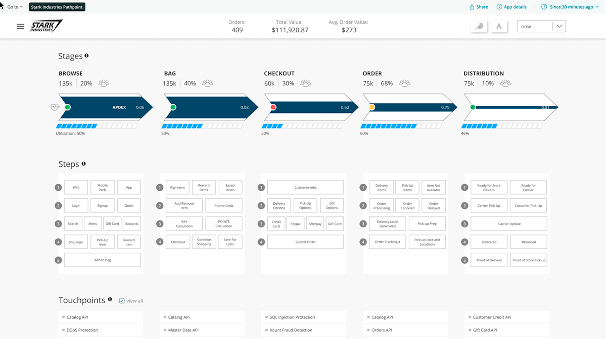
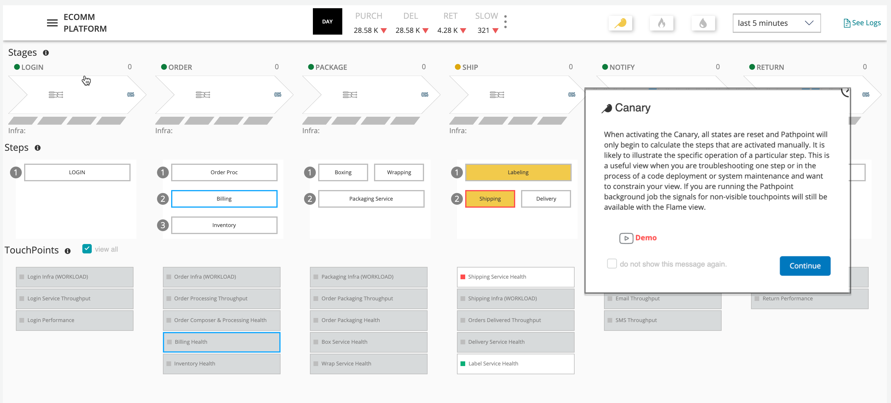
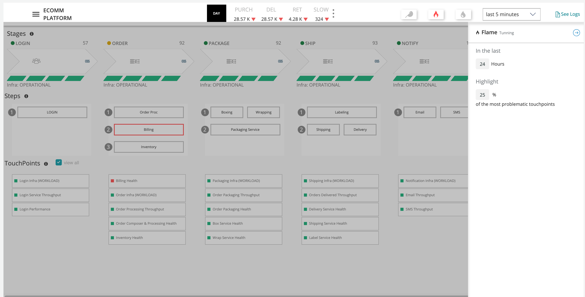
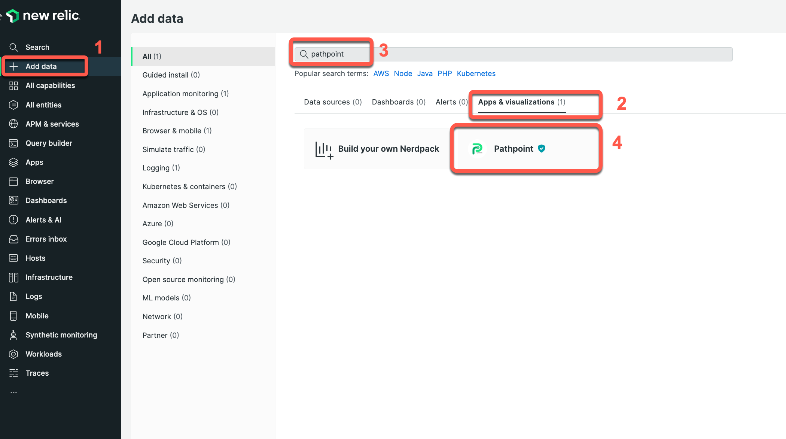
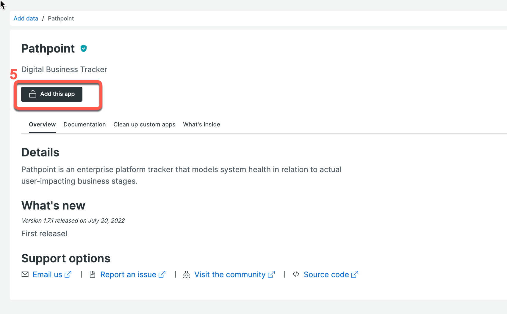

# Pathpoint

## NEW RELIC STAFF: For a working e-commerce config example compatible with Demotron use [this one](examples/nr-demotron-order-processing.json)

Other useful resources:

- [Pathpoint Demo Script](https://docs.google.com/document/d/1j1vO4J1RD77-VyJBwMrgMv9YfjjM7zHjkKENO34ryO4/edit?usp=sharing)
- [Dictionary of useful Pathpoint terms](https://docs.google.com/document/d/1eYuMxQelrmitJ5_SO74gut_jqTokFCi33Py77s1mK0c/edit?usp=sharing)

### Pathpoint now has a new GUI editor for stages, steps, and touchpoints!  Please provide feedback to jhagan@newrelic.com.

## Other Pathpoint Config Examples:
- *Dummy* config (suitable for any NR account)](examples/Pathpoint_Json_v1.5%20(13).json)
- [Simple e-commerce example](examples/e-commerce-membership.json)
- [video/media process example](examples/video-processing.json)

## Description

Pathpoint is an enterprise platform tracker that models system health in relation to actual user-impacting business stages.  

### Stages

These are the highest level business stages.   At the actual system level these will be a rollup of many services and methods.  PathPoint will give us a view of Latency, Utilization and Errors for each high level business stage.  As an example from an e-commerce customer may identify the following business critical stages: PRE-PROCESSING, PRE-ORDER, CHECKOUT, ORDER MANAGEMENT, DISTRIBUTION & RETURNS.

### Steps

These are “sub-stages” of a parent stage.  that represent a more granular aggregation of services.  Clicking on a step will highly show more detailed services and functions in the TouchPoints list below.  If a stage has a red border it means there is an error anomaly for this stage.  Below are example steps from an ecommerce company.  In this example these steps correspond to APM services.

### Touchpoints

These are the most granular entities in the PathPoint model.  PathPoint TouchPoints are often a specific APM or Browser application, but you can use any NRQL query as a touchpoint.  The health status of a TouchPoint will be tied to error rate and latency.

### Canary Filter

### Flame Filter

## Open source license

This project is distributed under the [Apache 2 license](LICENSE).

## What do you need to make this work?

Pathpoint will work in nearly any New Relic account.  To get started you'll need some telemetry in your account that you care about.  This could be any of the following telemetry types: Metrics, Events, Logs, Traces.  A common starting place for Pathpoint is APM Events and Logs, but it is up to you.   The other thing you'll need to know is how this telemetry maps onto the business process you want to model as stages and steps.  That may require some internal disucssions with your stakeholders to understand how things really fit  in.

When you are ready to make some edits you can simply download the current version of the JSON config, edit and re-upload it.  You can also use "right click" to adjust touchpoint configurations.

## In-Product Support

In the Pathpoint UI it is possible to submit a support issue which will be triaged by the Pathpoint team.   They will respond within a few days to update you on our overall assesment and if we are able to resolve the issue we'll provide an ETA.

## Installing Pathpoint

### Installing from the New Relic catalog (recommended)

Installing from within New Relic ensures you are using the verified catalog version of the app.  This means it has gone through the New Relic open source approval process.  The version deployed from the catalog may not always be the latest in the open source repository.

1. *Click the "Add data" menu item*
2. *Filter the installer to look at "Apps and Visualizations"*
3. *Type the word pathpoint in the text filter*
4. *Click on the installation icon for the verified Pathpoint*
5. *Clock "Add this app"*

Keep in mind that pathpoint configurations can be customized without any customization to the code.  Simply upload your modified JSON file to Pathpoint.  In addition you can make changes to the stages, steps, and touchpoints and save the current configuration as a JSON file.  We recommend you version control your own Pathpoint JSON file in your organizations own code repository.

### Serving a local branch locally

Occasionally you may want to experiment with the code and maybe you'll want to test some changes locally.   New Relic's programmability framework makes it possible to serve a [nerdpack locally](https://developer.newrelic.com/build-apps/publish-deploy/serve/).  This is the best approach when you just want to run a brief test of some code changes.

### Installing a custom branch (rarely needed)

Custom branches of Pathpoint are not supported by New Relic.  However you may want to make some modifications to the code and share it within your organization.  New Relic's developer site [developer.newrelic.com](developer.newrelic.com) has a very detailed [tutorial](https://developer.newrelic.com/build-apps/publish-deploy) on working with Nerdpacks including how to publish them to an account.

## Support

New Relic has open-sourced this project. This project is provided AS-IS WITHOUT WARRANTY OR DEDICATED SUPPORT. Issues and contributions should be reported to the project here on GitHub.

We encourage you to bring your experiences and questions to the [Explorers Hub](https://discuss.newrelic.com) where our community members collaborate on solutions and new ideas.

### Community

New Relic hosts and moderates an online forum where customers can interact with New Relic employees as well as other customers to get help and share best practices. Like all official New Relic open source projects, there's a related Community topic in the New Relic Explorers Hub. You can find this project's topic/threads here:

https://discuss.newrelic.com/t/pathpoint

### Issues / enhancement requests

Issues and enhancement requests can be submitted in the [Issues tab of this repository](../../issues). Please search for and review the existing open issues before submitting a new issue.

### Security

As noted in our [security policy](https://github.com/newrelic/nr1-pathponit/security/policy), New Relic is committed to the privacy and security of our customers and their data. We believe that providing coordinated disclosure by security researchers and engaging with the security community are important means to achieve our security goals.

If you believe you have found a security vulnerability in this project or any of New Relic's products or websites, we welcome and greatly appreciate you reporting it to New Relic through [HackerOne](https://hackerone.com/newrelic).

## Contributing

Contributions are encouraged! If you submit an enhancement request, we'll invite you to contribute the change yourself. Please review our [Contributors Guide](CONTRIBUTING.md).

Keep in mind that when you submit your pull request, you'll need to sign the CLA via the click-through using CLA-Assistant. If you'd like to execute our corporate CLA, or if you have any questions, please drop us an email at opensource+nr1-pathpoint@newrelic.com.
