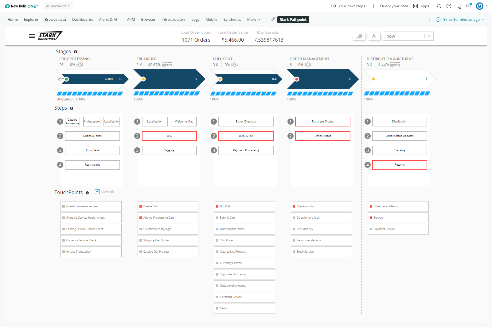
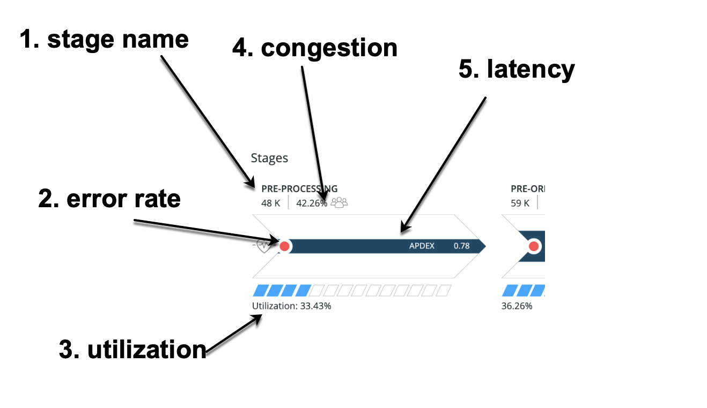
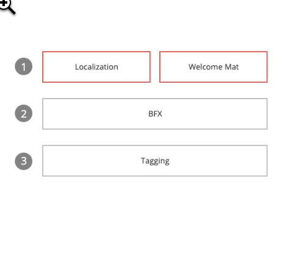
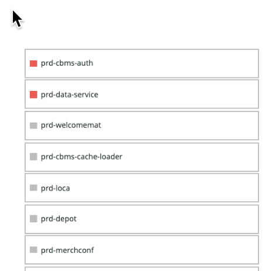

  [](https://snyk.io/test/github/newrelic/nr1-pathpoint)

[](https://opensource.newrelic.com/oss-category/#new-relic-experimental)

# Pathpoint



## About this Nerdpack

Pathpoint is an enterprise platform tracker that models system health in relation to actual user-impacting business stages.  

### Stages

These are the highest level business stages.   At the actual system level these will be a rollup of many services and methods.  PathPoint will give us a view of Latency, Utilization and Errors for each high level business stage.  As an example from an e-commerce customer may identify the following business critical stages: PRE-PROCESSING, PRE-ORDER, CHECKOUT, ORDER MANAGEMENT, DISTRIBUTION & RETURNS.



### Steps

These are “sub-stages” of a parent stage.  that represent a more granular aggregation of services.  Clicking on a step will highly show more detailed services and functions in the TouchPoints list below.  If a stage has a red border it means there is an error anomaly for this stage.  Below are example steps from an ecommerce company.  In this example these steps correspond to APM services.



### Touchpoints

These are the most granular entities in the PathPoint model.  With this version of PathPoint TouchPoints are usually a specific APM or Browser application.  The health status of a TouchPoint will be tied to error rate and latency.



## Open source license

This project is distributed under the [Apache 2 license](LICENSE).

## What do you need to make this work?

TBD

## Getting started

First, ensure that you have [Git](https://git-scm.com/book/en/v2/Getting-Started-Installing-Git) and [NPM](https://www.npmjs.com/get-npm) installed. If you're unsure whether you have one or both of them installed, run the following command(s) (If you have them installed these commands will return a version number, if not, the commands won't be recognized):

```bash
git --version
npm -v
```

Next, install the [NR1 CLI](https://one.newrelic.com/launcher/developer-center.launcher) by going to [this link](https://one.newrelic.com/launcher/developer-center.launcher) and following the instructions (5 minutes or less) to install and setup your New Relic development environment.

Next, to clone this repository and run the code locally against your New Relic data, execute the following command:

```bash
nr1 nerdpack:clone -r https://github.com/newrelic/nr1-pathpoint.git
cd nr1-pathpoint
nr1 nerdpack:serve
```

Visit [https://one.newrelic.com/?nerdpacks=local](https://one.newrelic.com/?nerdpacks=local), navigate to the Nerdpack, and :sparkles:

## Deploying this Nerdpack

Open a command prompt in the nerdpack's directory and run the following commands.

```bash
# To create a new uuid for the nerdpack so that you can deploy it to your account:
nr1 nerdpack:uuid -g [--profile=your_profile_name]

# To see a list of APIkeys / profiles available in your development environment:
# nr1 profiles:list
nr1 nerdpack:publish [--profile=your_profile_name]
nr1 nerdpack:deploy [-c [DEV|BETA|STABLE]] [--profile=your_profile_name]
nr1 nerdpack:subscribe [-c [DEV|BETA|STABLE]] [--profile=your_profile_name]
```

Visit [https://one.newrelic.com](https://one.newrelic.com), navigate to the Nerdpack, and :sparkles:

# Support

New Relic has open-sourced this project. This project is provided AS-IS WITHOUT WARRANTY OR DEDICATED SUPPORT. Issues and contributions should be reported to the project here on GitHub.

We encourage you to bring your experiences and questions to the [Explorers Hub](https://discuss.newrelic.com) where our community members collaborate on solutions and new ideas.

## Community

> Work with the Explorer's Hub team to create a tag for your app, then update the link below.

New Relic hosts and moderates an online forum where customers can interact with New Relic employees as well as other customers to get help and share best practices. Like all official New Relic open source projects, there's a related Community topic in the New Relic Explorers Hub. You can find this project's topic/threads here:

https://discuss.newrelic.com/t/{{ APP_NAME }}
*(Note: This URL is subject to change before GA)*

## Issues / enhancement requests

Issues and enhancement requests can be submitted in the [Issues tab of this repository](../../issues). Please search for and review the existing open issues before submitting a new issue.

## Security

As noted in our [security policy](https://github.com/newrelic/{{ NERDPACK_NAME }}/security/policy), New Relic is committed to the privacy and security of our customers and their data. We believe that providing coordinated disclosure by security researchers and engaging with the security community are important means to achieve our security goals.

If you believe you have found a security vulnerability in this project or any of New Relic's products or websites, we welcome and greatly appreciate you reporting it to New Relic through [HackerOne](https://hackerone.com/newrelic).

# Contributing

> Work with the Open Source Office to update the email alias below.

Contributions are encouraged! If you submit an enhancement request, we'll invite you to contribute the change yourself. Please review our [Contributors Guide](CONTRIBUTING.md).

Keep in mind that when you submit your pull request, you'll need to sign the CLA via the click-through using CLA-Assistant. If you'd like to execute our corporate CLA, or if you have any questions, please drop us an email at opensource+{{ APP_NAME }}@newrelic.com.
