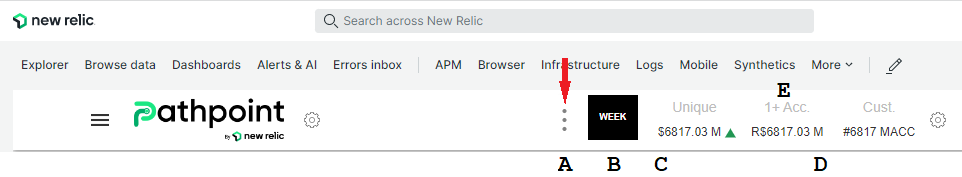
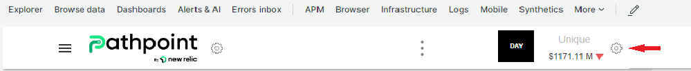
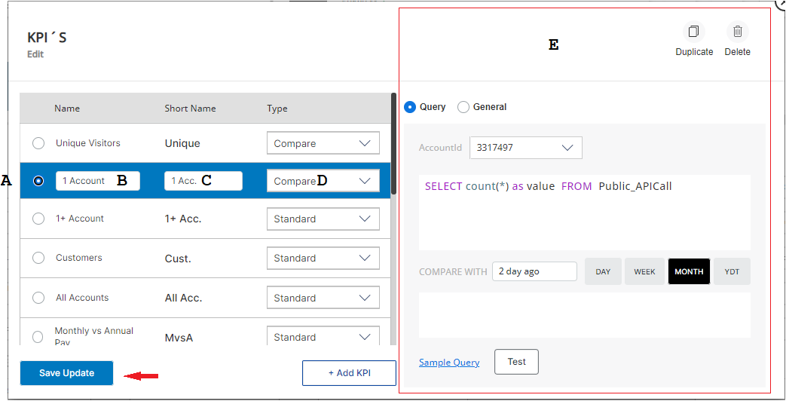
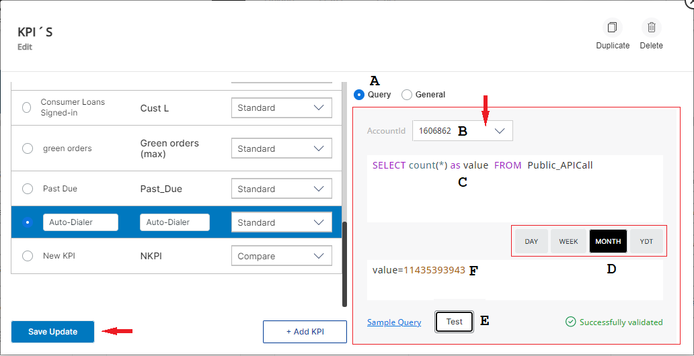
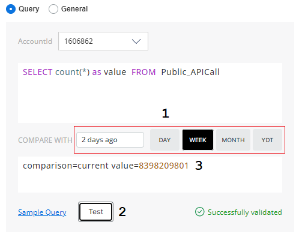
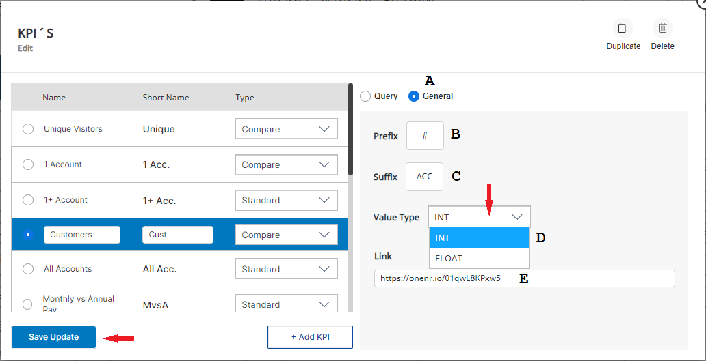
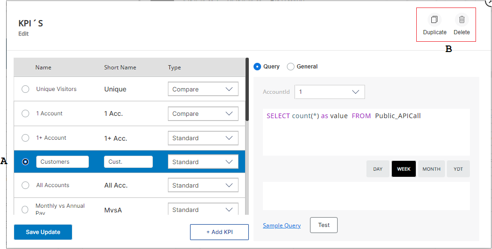
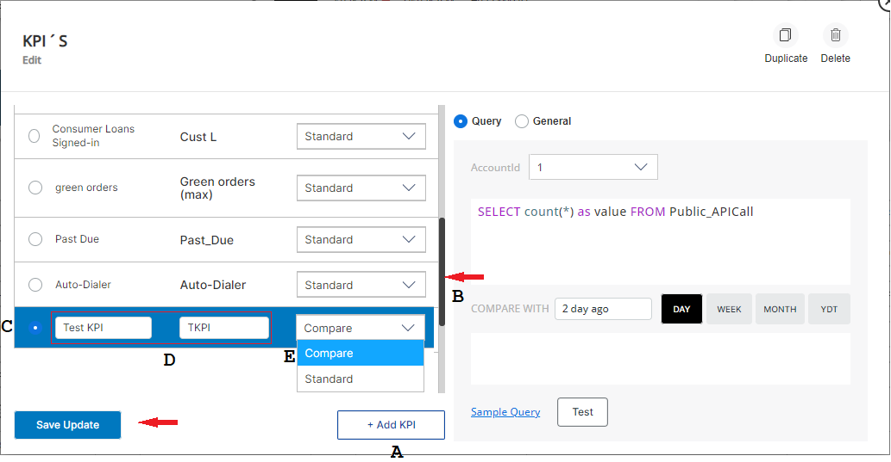
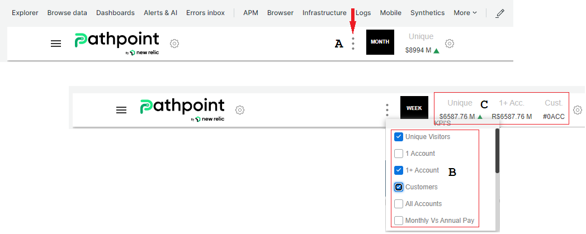

# KPIs GUI Guide
Version 1.6.4
 
# Index ###
 
* ## [The KPIs section in the new Pathpoint GUI ](#kpis)
* ## [How to change the configuration of the KPIs of your Pathpoint using its GUI](#kpis_gui)
* ## [How to work with the Query of a KPI](#query)
    * ## [How to use the Query of the Compare Type](#compare)
* ## [How to work with the General settings of a KPI](#general)
* ## [How to Duplicate or Delete a KPI](#duplicate_delete)
* ## [How to add a NEW KPI](#new_kpi)
* ## [How to use the KPI selector to add KPIs to the KPIs section of your Pathpoint  ](#kpi_selector)

## The KPIs section in the new Pathpoint GUI ###

KPIs by their acronym (Key Performance Indicator), are known as key indicators, which allow you to view the performance of a process. In the case of Pathpoint, KPIs fulfill a fundamental function, which is the measurement of specific indicators, within a particular process. 

These are the different parts of the KPIs section of the NEW Pathpoint GUI:  

A. Click on the 3 dots, to the left of the KPIs section, to use the select KPI section.  
B. This is the comparison date setting, you can pick; Day, Week, Month, or YTD.   
C. Prefix: It is used in the case in which you want to Identify the KPI by placing a symbol or letter at the beginning of the name. Example: “$”.  
D. Suffix: It is used in the case where you want to Identify the KPI by adding a symbol or letter at the end of the name. Example: “M”.   
E. ShortName: Corresponds to the short name of the KPI. This is the name that is shown in the KPI section. 

When you click on the KPI selector, you will see the Long names of the KPIs. In this guide you will learn how to change both, the short names and the Long names of the KPIs.
 
Return to top of [Index](#Index)

## How to change the configuration of the KPIs of your Pathpoint using its GUI ###

This version of Pathpoit, as was the case with previous versions, allows for the configuration of several ad hoc KPIs, up to 5, to be shown in the top banner, on the following example only 1 KPI is selected.

To start making changes to the KPI’s configuration, in the NEW version of Pathpoint, 1.6.4, click on the Settings button (to the right of the KPI’s section). Now, a dialog box window will show you the different options you can use to change the configuration of the Stages of your Pathpoint.

This is the way to start working with the configuration of a KPI, from the GUI:

A. Click on the KPI you want to work with, to select it.
This is the Long name of the KPI, to change it, click on the name shown (in this example, 1 Account), remove it, and type the new name for it.  
B. This is the Short name of the KPI, to change it, click on the name shown (in this example, 1 Acc), remove it, and type the new name for it.  
C. This is the Type of the KPI selector, there are two types of KPIs: Compare and Standard. To change the type of KPI, just click on the type shown, and select the one you want to use instead.  
D. On the right panel, there are a series of actions you can take, for a selected KPI, like Duplicate or Delete the KPI.

Please note, that a compare type of KPI compares the resulting data, to data in the past hour, day, week, month, or year. A standard KPI just presents you with the resulting raw data. Please note, that if you make any changes to the KPIs configuration, save them by clicking on “Save Update”.  

Return to top of [Index](#Index)

## How to work with the Query of a KPI ###

This is the Query, that that is used to perform the measurement of the KPI, from the two types of Queries available for KPIs; Standard and Compare.

To start making changes to the KPI’s configuration, in the NEW version of Pathpoint, click on the Settings button (to the right of the KPI’s section). Now, a dialog box window will show you the different options you can use to change the configuration of the Stages of your Pathpoint.

This is the way to work with the Queries of a KPI, after selecting the KPI you want to work with:

A. Click on Query.  
B. Select the right account #.  
C. This is the Query (of the Standard type), which corresponds to the query that is used to perform the measurement, in this Query, the variable has to be; “As value”.    
D. Select the time measurement, be that Day, Week, Month, or Year.    
E. Click on “Test” to test the validity of the KPI.  
F. This space shows the “Value” of the result of the Query.  

If you make any changes to the KPIs configuration, save them by clicking on “Save Update”.

Return to top of [Index](#Index)

## How to use the Query of the Compare Type ###

If you need to compare a set of data, to data in the past,  select the Compare type for your KPI.

This is the way to Query a KPI of the Compare Type:

1. In the Space in Front of Compare, type the length of time you want to compare your data with, for instance “2 days ago”. Now, click on the Day, Week, Month or YTD to set up the time frame against which the first measure has to be compared with.  
2. To test the KPI, click on “Test”, if the test is successful, you will get a “Successfully validated” message.  
3. This is the resulting data of the comparison Query.
You can change any part of the Query, as long as the variable is presented “As value”, then test the Query. 

Please note, that if the validation of a KPI fails, it might be something as simple as that you are running the Query on the wrong account #, so try changing the account number, click on the account space, and  run the validation test again. 
 
Return to top of [Index](#Index)

## How to work with the General settings of a KPI ###

You can change some of the settings of your KPIs, like the Prefix, Suffix, and Value type, in the “General” section, as well as set the URL link to the Dashboard of the KPI.

To start making changes to the KPI’s configuration, click on the Settings button (to the right of the KPI’s section). Now, a dialog box window shows you the different options you can use to change the configuration of the KPIs of your Pathpoint. Now, click on the KPI you want to work with, to select it.

This is the way to work with the general options of a KPI:

A. Click on “General”.   
B. Prefix: It is used in the case in which you want to Identify the KPI by placing a symbol or letter at the beginning of the name. Example: $. To set the Prefix, click inside the white space and type it. If there is already a Prefix remove it, and type the new one.    
C. Suffix: It is used in the case where you want to Identify the KPI by adding a symbol or letter at the end of the name. Example: M%. To set the Suffix, click inside the white space and type it. If there is already a Suffix remove it, and type the new one.    
D. Value_type: It can be an integer value "INT" (example: 712) or a decimal value "FLOAT" (example: 712.25). You can change this value, by clicking on the value shown, and selecting the one you want to use instead.  
E. Link: Corresponds to the link that directs to the KPI dashboard. You can change this link, by selecting the URL shown, removing it, and typing the new one.  

When you click on a KPI, on your Pathpoint, it opens the link of the KPI dashboard saved in the General Tab. Please note that if you make any changes to the KPIs configuration, that you should save them by clicking on “Save Update”.
  
Return to top of [Index](#Index)

## How to Duplicate or Delete a KPI ###

On this version of Pathpoint, you can easily duplicate, or delete a KPI, from the GUI, just by doing a few clicks of the mouse, which in previous versions of Pathpoint could only be accomplished by using a JSON configuration file.

To begin making changes to the KPI configuration of your Pathpoint, click on the round Settings button (to the right of the KPI name).

These are the steps to duplicate, or delete a KPI:  

A. Begin by selecting the KPI you would like to work with.  
B. Next, click on the action you want to take for the selected KPI, for instance, to duplicate it, click on Duplicate (on the right panel), now a copy of the selected KPI will be created, at the bottom of the last KPI on this list (you might need to click on the scrolling slider on the right to see it). To delete a KPI, click on "Delete". 

Please keep in mind that when you choose to delete a KPI you will be asked to confirm that that is really what you want to do; to delete it, click on the “Confirm” prompt. If you make any changes to the KPIs configuration, save them by clicking on “Save Update”.

Return to top of [Index](#Index)
 
## How to add a NEW KPI ###

In this GUI version of Pathpoint is very easy to add and name a NEW KPI, with just a few clicks of the mouse.

To begin making changes to the KPI configuration of your Pathpoint, click on the round Settings button (to the right of the KPI name).

This is the way to add a NEW KPI: 

A. Click on “+Add KPI”.  
B. Use the scroll bar/slider, and pull it down, to see the NEW KPI.  
C. Now, click on the side of the KPI, to select it.  
D. Next, click on the blank space (It reads “New KPI” for the long name and “NKPI” for the short name), remove the suggested name, and type the name you’d like to use for this NEW KPI, for both the Short and the Long name, to finish setting it up.    
E. Likewise, click on the Type of KPI space, the default is Standard, if you like, you can change it to “Compare”.  

A compare type of KPI compares the resulting data, to data in the past hour, day, week, month, or year. A standard KPI just presents you with the resulting raw data. Please note, that if you make any changes to the KPIs configuration, save them by clicking on “Save Update”.If you make any changes to the KPIs configuration, save them by clicking on “Save Update”.

Return to top of [Index](#Index)

## How to use the KPI selector to add KPIs to the KPIs section of your Pathpoint ###

In a Pathpoint you can select to display, in the KPI section, up to 5 KPIs from the list of KPIs you’ve previously added to your Pathpoint.

To begin making changes to the KPI configuration of your Pathpoint, click on the round Settings button (to the right of the KPI name).

This is the way to use the KPIs selector, to add or remove KPIs from the KPIs section:  

A. Click on the 3 dots, to the left of the KPIs section, to see the select KPI section.  
B. Now, in this list, you can see the Long names of the KPIs you’ve previously added to your Pathpoint. To select to show a KPI in the KPI section of your Pathpoint, click to select it. To unselect a KPI you’ve previously selected, click on it, to unselect it.  
C. Finally you can see the Short Names of the KPIs you’ve selected to show on the KPIs area of your Pathpoint.

You can use this guide to change the Long and short names of your KPIs, so there are easier to differentiate, from other KPIs.
 
 Return to top of [Index](#Index)
 
 
 
 
 
 
