# Touchpoints GUI Guide
Version 1.6.4
 
 # Index ###

 
* ## [How to to change the configuration of the Touchpoints of your Pathpoint using its GUI](#touchpoints)
* ## [How to change a Touchpoint Type](#touch_type)
* ## [How to Hide, Duplicate or Delete a Touchpoint](#hide_duplicate_delete)
* ## [How to add a NEW Touchpoint](#new_touchpoint)
* ## [How to work with the different attributes of a Touchpoint](#attributes)
    * ### [How to change the Step Mapping of a Touchpoint](#step_mapping)
    * ### [How to change the Tuning of a Touchpoint](#tuning)
    * ### [How to work with the Query of a Touchpoint](#query)
    * ### [How to set the URL of a Touchpoint Dashboard](#url)
    * ### [How to turn a Touchpoint ON or Off](#on_off)

## How to to change the configuration of the Touchpoints of your Pathpoint using its GUI ###

Touchpoints represent the current state of an Application, System, Transaction, Web Service, 
or User. This is achieved through NRQL Queries, Custom Tuning, and Links to a Dashboard or Telemetry Tool.  

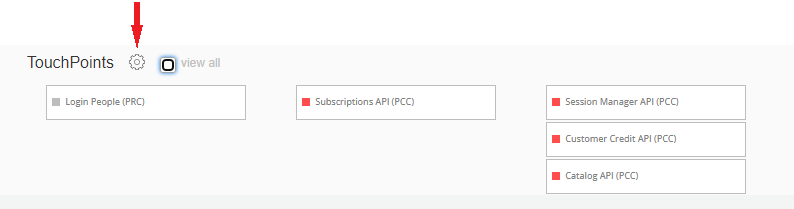

To begin making changes to the Touchpoints configuration of your Pathpoint using its GUI, click on the round Settings button (to the right of the Touchpoints name).
 

Now, a dialog box window opens up, from which you can start changing the configuration of the Touchpoints, of your Pathpoint.

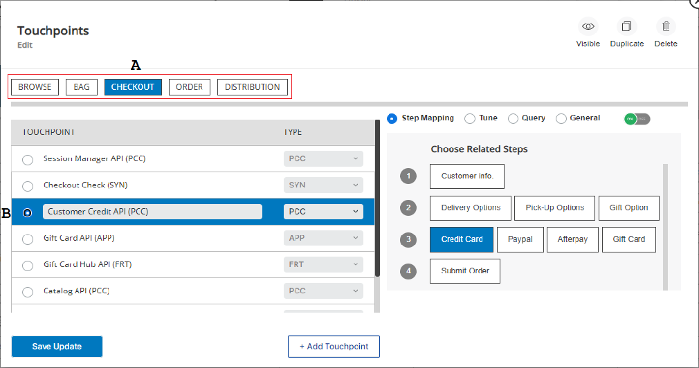

This is the way to start working on the configuration of a Touchpoint, from the GUI: 

A. Click on the Stage under which the Touchpoint you would like to work with is, for instance, to work with the “Customer Credit API (PCC)” Touchpoint I selected the “Checkout” Stage because that touchpoint is under the “Checkout” Stage.  
B. Now, from the list of Touchpoints, select the Touchpoint which you’d like to change/work, for this example I chose the “Customer Credit API (PCC)” one.
 
If you notice, next to the round setting button, there is a “View all” label, that you can use to see all the Touchpoints. Now, on this GUI version of Pathoint, when you click on the round settings button, on the window that opens up, you can see and work with all the Touchpoints that are located under the Stage you chose.

Return to top of [Index](#Index)
 
## How to change a Touchpoint Type ###
On this version of Pathpoint, you can also easily change a Touchpoint type, using a Pull Down menu, from the 10 different kinds of Touchpoints.

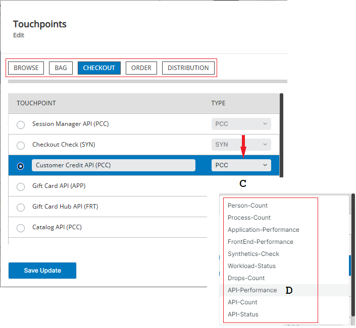
 
This is the way to change the Touchpoint type, after selecting the Stage and the Touchpoint you want to work with:
 
C. Begin by clicking on the current type. In this example, the current type for this Touchpoint is PCC.  
D. To change the Touchpoint type, click once on the name -on the list- of the NEW type, for the Touchpoint, to select it.
 
To save the changes you’ve made, click on “Save Update”.
 
Return to top of [Index](#Index)

## How to Hide, Duplicate or Delete a Touchpoint ###
 
On this version of Pathpoint, you can easily hide, duplicate, or delete Touchpoints, from the GUI.

As you saw before, to begin making changes to the Touchpoint configuration of your Pathpoint, click on the Settings button (to the right of the Touchpoints name).

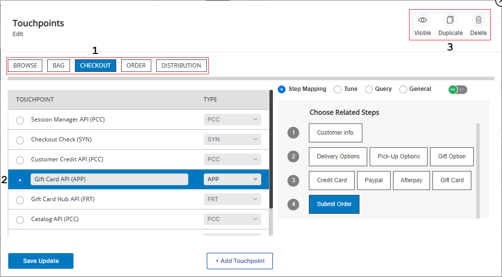

These are the steps to hide, duplicate, or delete a Touchpoint:

1. Begin by selecting the Stage under which the Touchpoint you would like to work with is, for instance, to work with the “Gift Card API (APP)” Touchpoint I selected the “Checkout” stage because that touchpoint is under the “Checkout” Stage.  
2. From the list of Touchpoints, click to select the Touchpoint which configuration you’d like to change, for this example I chose the “Gift Card API (APP)” one.  
3. Next, click on the action you want to take for the selected Touchpoint, for instance, to hide it, click on “Visible”, which hides the Touchpoint. To duplicate it, click on Duplicate, now a copy of the selected Touchpoint will be created (the duplicate Touchpoint name will end in “Copy”), at the bottom of the last Touchpoint on this list (you might need to click on the scrolling slider on the right to see it). To delete a Touchpoint, click on "Delete". Keep in mind that when you choose to delete a Touchpoint you will be asked to confirm that that is really what you want to do; to delete it, click on the “Confirm” prompt. 

Finally, you must click on the “Save Update” button, to save any changes you’ve made. Later on, you can follow the same steps and then click on “Visible” (the icon will be of the reddish color) again to make a Touchpoint you chose to hide visible again.

Return to top of [Index](#Index)
 
## How to add a NEW Touchpoint ###

In this GUI version of Pathpoint is very easy to add a NEW Touchpoint, after selecting the Stage you would like to add it to.

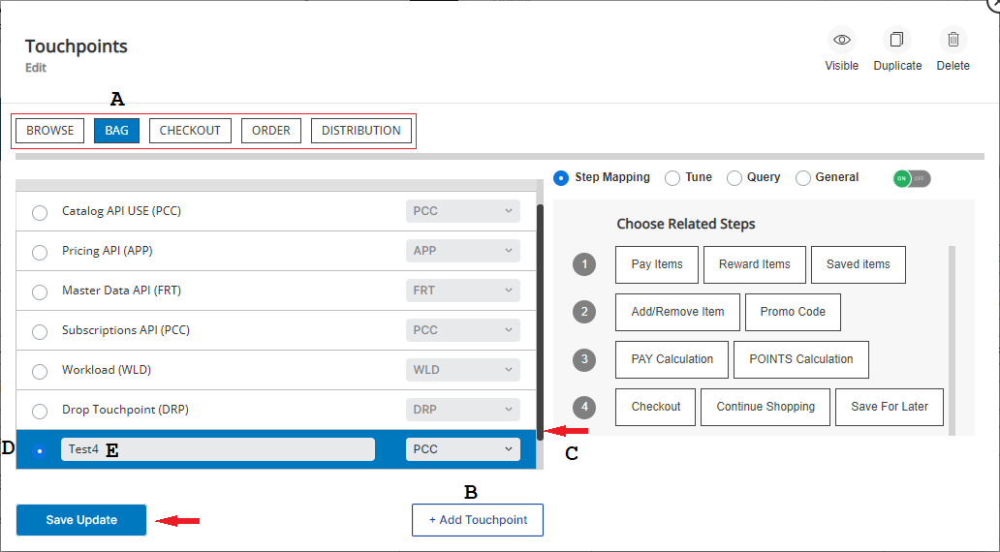

This is the way to add a NEW Touchpoint:  

A. Select the Stage under which you would like to work, for instance; “Bag”.  
B. Now, click on “+Add Touchpoint”.  
C. Use the scroll bar/slider, and pull it down, to see the NEW Touchpoint.  
D. Next, click on the side of the Touchpoint, to select it.  
E. Finally, click on the blank space (it reads “New Touchpoint”), remove the suggested name, and type the name you’d like to use for this NEW Touchpoint, to finish setting it up.

If you like, at this point, you can also change the type of the Touchpoint, by clicking on the type shown and selecting a new Type. Click on the “Save Update” button, to save any changes you’ve made to the configuration of your Pathpoint.
 
Return to top of [Index](#Index)

## How to work with the different attributes of a Touchpoint ###
 
In this version of Pathpoint, 1.6.4, you can easily work/change the different attributes of a Touchpoint in your Pathpoint from its GUI, which is something that in previous versions of Pathpoint could only be done using a JSON configuration file.

These are the attributes you can work on/change on the configuration of a Touchpoint, from the GUI:  
* Step Mapping  
* Tune  
* Query  
* General (set the URL of a Touchpoint)  
* Turn it On or Off

To begin making changes to the attributes of a Touchpoint, click on the Settings button (to the right of the Touchpoints name).

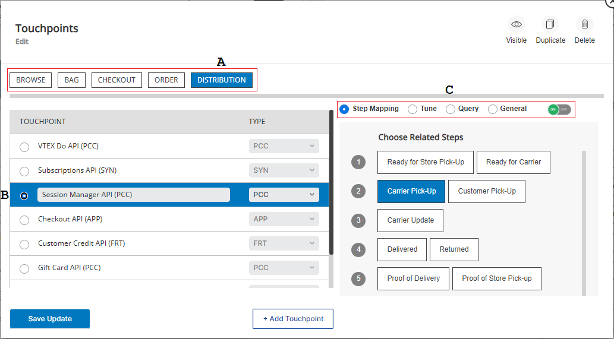
 
This is the way to start working with the attributes of a Pathpoint Touchpoint, after selecting the Stage under which the Touchpoint you would like to work with is:  

A. For instance, to work with the “Session Manager API (PCC)” Touchpoint, I selected the “Distribution” Stage because that touchpoint is under that Stage.  
B. Now, select the Touchpoint which you’d like to change, for this example I chose the “Session Manager API (PCC)” one.  
C. Next, on the right panel, select the attributes you would like to work/change.

Now, you will see how to change the attributes of your Touchpoints, starting on how to change the Step Mapping of a Touchpoint, with can be accomplished with just a few clicks of the mouse.

Return to top of [Index](#Index)

## How to change the Step Mapping of a Touchpoint ###

To begin making changes to the attributes of a Touchpoint, click on the Settings button (to the right of the Touchpoints name).

As you saw in previous examples, begin by selecting the Stage under which the Touchpoint you would like to work with is, for instance, to change the Step mapping of the “Checkout API (APP)”, select the “Distribution” Stage first.

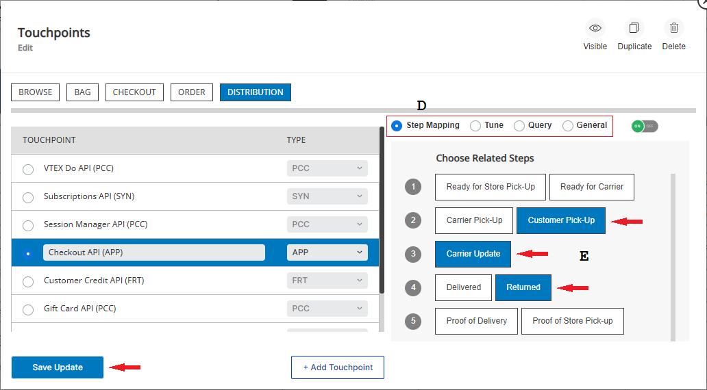
 
This is the way to assign/change the Step mapping of a  Touchpoint, after selecting the Touchpoint you would like to work with, for this example, I chose the “Checkout API (APP)” touchpoint:  

D. Now, click on “Step Mapping”.  
E. Next, select each one of the Steps you would like to map this particular Touchpoint to. You can even click to unselected Steps that you’ve previously mapped this Touchpoint to (their labels will look bluish), by clicking on their name, one by one, to unselect them. 
 
Finally, click on the “Save Update” button, to save any changes you’ve made to the configuration of your Pathpoint.

Return to top of [Index](#Index)
 
## How to change the Tuning of a Touchpoint ###

To begin making changes to the attributes of a Touchpoint, click on the Settings button (to the right of the Touchpoints name).

A Touchpoint is the pulse of each Pathpoint, your ability to test, and tune your Touchpoints is key to getting better data from your Pathpoint, and bear in mind that the values you will see at the beginning of the tuning process were either changed previously by you or were defined on the JSON file uploaded to your Pathpoint.

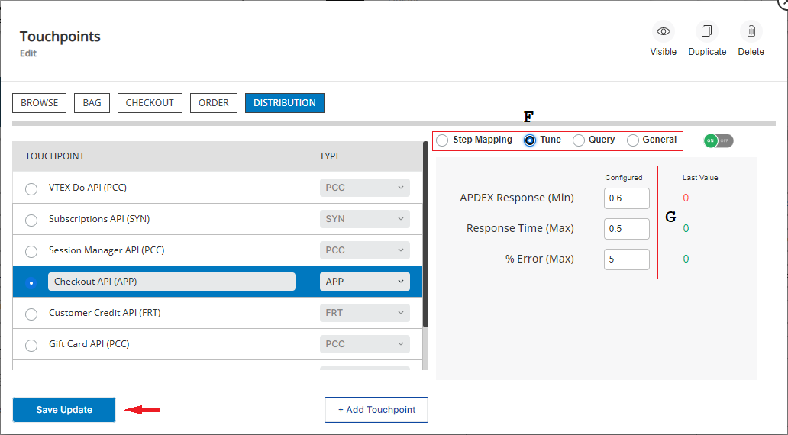

This is the way to start working with the tuning of a  Touchpoint:  
 
F. Click on Tune, after selecting the Stage, and the Touchpoint you would like to Tune.   

Touchpoint can be individually tuned via:

* Min/Max  
* Success %  
* Apdex  
* Errors %  
* Duration Time  
* Response Time  
* Count  

Note: Tuning options change depending on the Touchpoint type.

These are the Standard Touchpoints, and their Tuning options:

## * PRC (PERSON COUNT)  
COUNT Touchpoint

    Min Sessions Count
    Max Sessions Count

## * PCC (PROCESS COUNT)  
COUNT Touchpoint 

    Min Transactions Count
    Max Transactions Count

## *   APP (APPLICATION)  
PERFORMANCE Touchpoint

    Min APDEX
    Max Response Time
    Max Error Percentage

## * FRT (FRONT-END)  
PERFORMANCE Touchpoint

    Min APDEX
    Max Response Time
    Max Error Percentage

## * SYN (SYNTHETICS)  
CHECK Touchpoint

    Max Average Response Time
    Max Total Check Time
    Min Success Rate

## * WLD (WORKLOAD)  
STATUS Touchpoint 

    No tuning

## * DRP (DROP)     
 DROP Touchpoint

    No tuning

## * API (API PERFORMANCE)  
PERFORMANCE Touchpoint  

    Min APDEX
    Max Response Time
    Max Error Percentage

## * APC (API COUNT)  
COUNT Touchpoint  

    Min API Count

## * APS (API STATUS)  
STATUS Touchpoint

    Min Success Percentage

If you wish to change the values of the tuning of a Touchpoint, be that on the; APDEX Response (Min), Response TIme (MAX), or Error (Max), click on the space, with the # value and type the new value. 

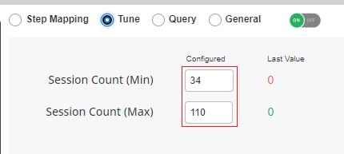
 
In this example of the tuning of this Touchpoint, you can see that there are two important values:

* Session count (Min), if the value (under "Configured"), is for example set at 34, and the value of sessions, within the last 5 minutes, is below this number, the status of the Touchpoint will turn red. You can change this #, for instance to 20, as your business needs require.

* Session count (Max), if the value (under "Configured"), is for example set at 110, and the value of sessions, within the last 5 minutes, is above this number, the status of the Touchpoint will turn red. You will also see the color of the Stage label turn, from blue, to white. You can change this #, for instance to 120, as your business needs require.

 
Finally,if you wish to save any changes you've made to the configuration of your your Pathpoint, click on the “Save Update” button.

 
Return to top of [Index](#Index)

## How to work with the Query of a Touchpoint ###

A Touchpoint is the pulse of each Pathpoint, and your ability to run Queries is very important to get the right data you seek. Touchpoint queries are written in NRQL, which is New Relic's SQL-like query language. In general, NRQL allows you to retrieve detailed New Relic data and get insight into your applications, hosts, and business-important activity.

And please keep in mind that:

* You can Query Multiple accounts  
* Queries can be modified, customized, or completely replaced  

Note: Queries have certain dependencies based on the specific Touchpoint.

These are the Standard Touchpoints, and what are they looking for in their Queries:

 ### * PRC (PERSON COUNT)  
COUNT Touchpoint  

    SELECT uniqueCount(session) as session FROM PageView WHERE appName='My-FrontEnd-App-Name' AND name='Transaction/path'

### * PCC (PROCESS COUNT)
COUNT Touchpoint 

    SELECT uniqueCount(*) as count from Transaction WHERE appName='My-App-Name' AND name='My-transaction/path'

### *   APP (APPLICATION)
PERFORMANCE Touchpoint

    SELECT filter(apdex(duration, t:0.028), WHERE 1=1) as apdex, filter( max(duration), WHERE 1=1) as response,filter(percentage(count(*), WHERE error is true), WHERE 1=1) as error from Transaction WHERE appName='My-App-Name'

### * FRT (FRONT-END)
PERFORMANCE Touchpoint

    SELECT filter(apdex(duration, t:1), WHERE 1=1) as apdex, filter( max(duration), WHERE 1=1) as response,filter(percentage(count(*), WHERE error is true), WHERE 1=1) as error from PageView WHERE appName='My-Front-End-App-Name'

### * SYN (SYNTHETICS)
CHECK Touchpoint

    SELECT filter(percentage(count(result),WHERE result='SUCCESS'),WHERE 1=1) as success, max(duration) as duration, max(longRunningTasksAvgTime) as request from SyntheticCheck,SyntheticRequest WHERE monitorName='My-monitor-Name'

### * WLD (WORKLOAD)
STATUS Touchpoint 

    SELECT latest(statusValue) as statusValue FROM WorkloadStatus WHERE entity.name='My-Workload-Name'

DRP (DROP)
DROP Touchpoint
 
    SELECT uniqueCount(*) as count FROM PageAction WHERE name='transaction/path/that/generate/a/drop'

### * API (API PERFORMANCE)
PERFORMANCE Touchpoint  

    SELECT filter(apdex(duration, t:1.5), WHERE 1=1) as apdex, filter( max(duration), WHERE 1=1) as response,filter(percentage(count(*), WHERE error is true), WHERE 1=1) as error from Public_APICall WHERE awsRegion='eu-west-1'

### * APC (API COUNT)
COUNT Touchpoint  

    SELECT uniqueCount(*) FROM Transaction WHERE appName='global-lending-platform-prd' AND name ='WebTransaction/WebFrameworkUri/Koa/POST//transactions'

### * APS (API STATUS)
STATUS Touchpoint

    SELECT percentage(count(*),WHERE isStatus='ok') as percentage from PathpointKpiHealth

To begin making changes to the attributes of a Touchpoint, click on the Settings button (to the right of the Touchpoints name).

Now, to beging working with a Touchpoint Query, click on the Stage, and the Touchpoint you would like to work with its Query.
 
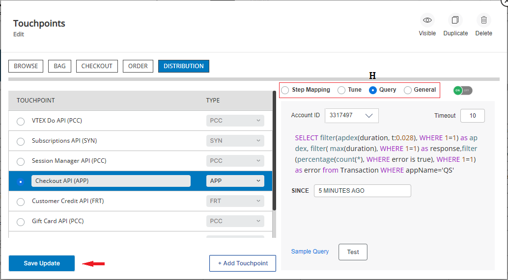

Now, to work with its Query:  

H. Click on Query.

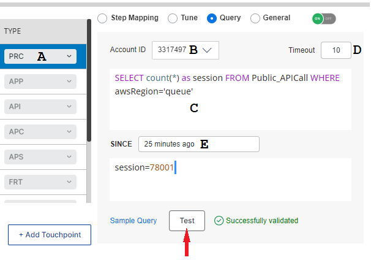

These are the different parts of the query box window, of a Touchpoint:   

A. This is the type of Touchpoint (in this example a "PRC" person count).  
B. AccountID: Determines the account with which the query is identified.  
C. Query: Displays the actual query that determines the behavior of the Touchpoint.   
D. Query_timeout: Determines the maximum time of activity in which the query will be executed.  
E. Measure_time: Determines the time from when you want the query to collect information to perform the measurement. 

If you chose to change the given Query, by changing some of the variables of a particular Touchpoint, test your changes by clicking on "Test", to make sure the Touchpoint is "healthy", if it is, then save them (click on "Save/Update"). Now, if the validation fails, find out why, and fix it, then test it again until you get the "Successfully validated" message.

Please note that if you get an "Incorrect validated" error, when testing a Touchpoint, it might be something as simple as because you are running the Query on the wrong AccountID.

Return to top of [Index](#Index)

## How to set the URL of a Touchpoint Dashboard ###
If you want to get additional data, to the one you get on your Pathpoint, you can get it by visiting the Touchpoint Dashboard, which can be set by you.

Touchpoints may be linked to a:

* Custom Dashboards  
* New Relic Tools  
* External Page or Service

On this GUI version of Pathpoint is very easy to link a Touchpoint to the URL of a Dashboard, New Relic Tool, or an External page/service.

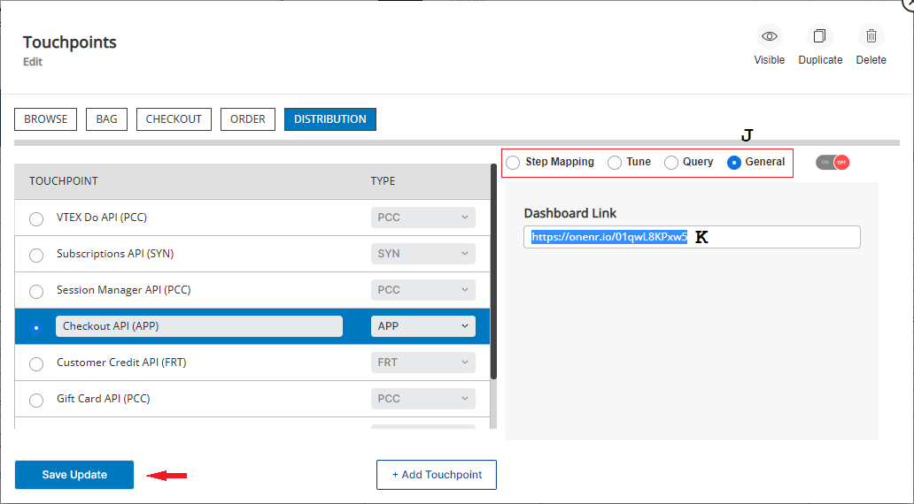

This is the way to set the URL of a Touchpoint, after selecting the Stage, and the Touchpoint you want to work with:

J. Click on General.  
K. Under the Dashboard Link, you will see the current URL of the Touchpoint. To change it, select it, and type the NEW url of the Touchpoint you chose.
 
Finally, click on the “Save Update” button, to save any changes you’ve made to the configuration of your Pathpoint, or if you haven't made any changes, X out of this dialog box window, by clicking on the X on the top right hand side of the window, or by pressing the ESC key.

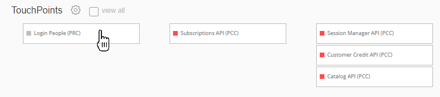

To see the Dashboard, New Relic Tool, or the External Page or Service a touchpoint is linked to, just click on its name.

Return to top of [Index](#Index)

## How to turn a Touchpoint ON or Off ###
If you need to troubleshoot a particular Touchpoint, by turning it off, you can do it from the GUI, and later on, you can also turn it back on.

As you saw before, to begin making changes to the attributes of a Touchpoint, click on the Settings button (to the right of the Touchpoints name).

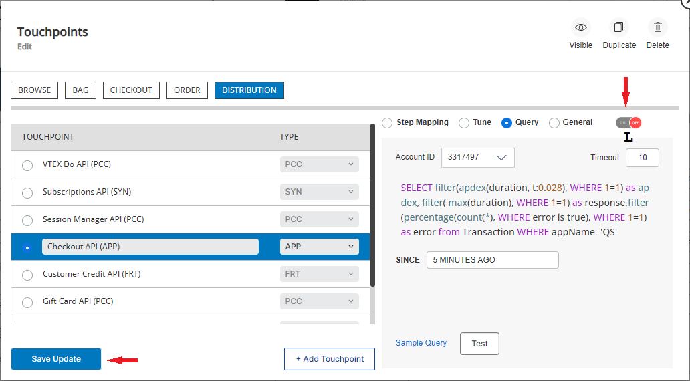

This is the way to  turn a Touchpoint ON or OFF, after selecting first the Stage, and the Touchpoint you want to work with:

K. Click on the green ON button on the right panel  (if the Touchpoint is ON), now the Touchpoint will be turned OFF. To turn it back ON, click on the red button.
 
Finally, click on the “Save Update” button, to save any changes you’ve made to the configuration of your Pathpoint.

Return to top of [Index](#Index)