# Steps Guide

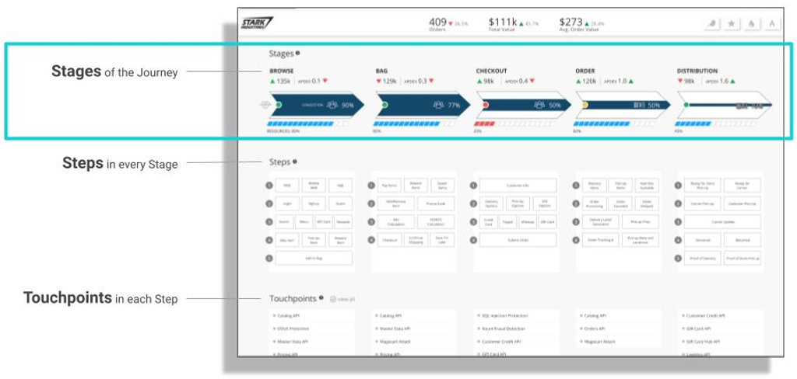

## Introduction

### Stages mark the principal parts of the Journey of a Pathpoint   

A STAGE consists of  STEPS, TOUCHPOINTS and INFRASTRUCTURE WORKLOADS. 

Through the combination of these elements and their respective data sources, a STAGE provides a collective view of the:

●	Health  
●	Person Count  
●	Process Count  
●	Congestion  
●	And Infrastructure Status of a Pathpoint

## Coverage

Example Areas of Business and Operations that can be covered in a STAGE:

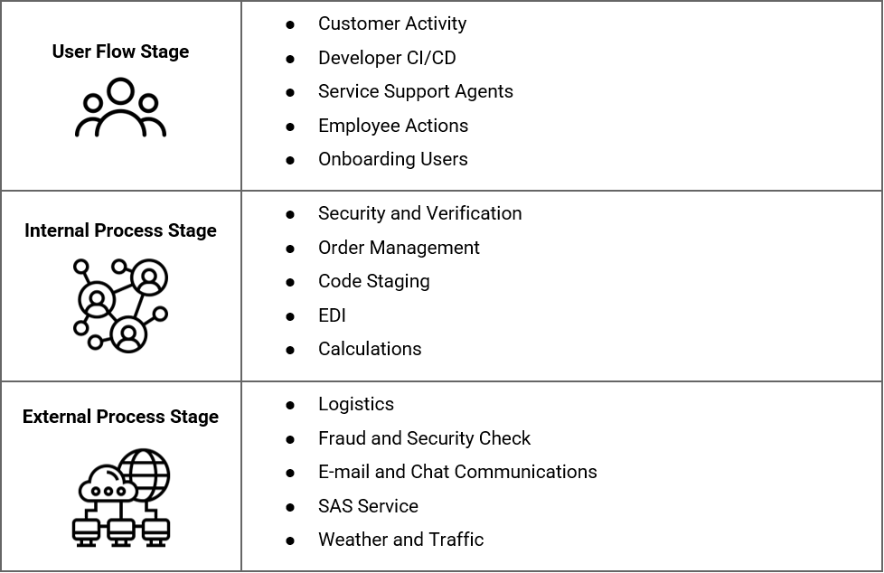

### STAGE COUNT: 

The number displayed at the top right corner of each STAGE, represents the sum of the COUNT of Touchpoints utilized within the STAGE.

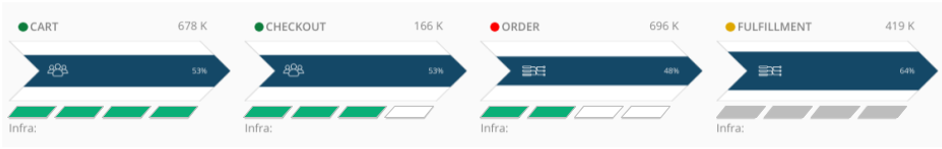

A STAGE COUNT can be categorized as either a total PERSON count or total PROCESS count. This is Determined by the use of either Person Count (PRC) Touchpoints or Process Count (PCC) Touchpoints within a STAGE, and visualized with an icon on the left part of the Stage.

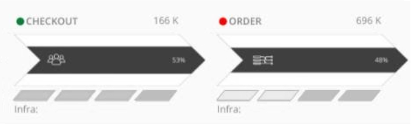

In this example graphic you can see the two types of Stages:

•	On the left you can see a Stage of the type that counts people.   
•	And on the right, you can see a Stage of the type that counts processes.

### PERSON COUNT 

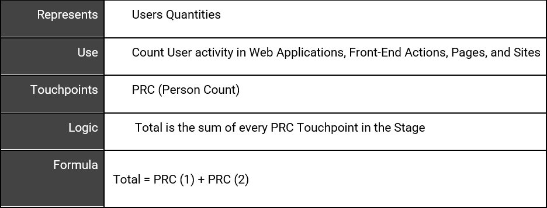

### PROCESS COUNT 

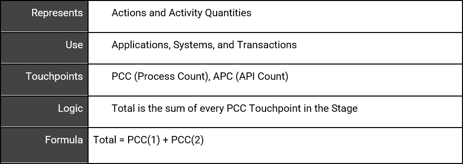

### HEALTH 

Is displayed graphically, by a color displayed to the left of the STAGE name. And these are the 3 colors, as you can see on the next example graphic, that are used; Green, Yellow or Red.
 
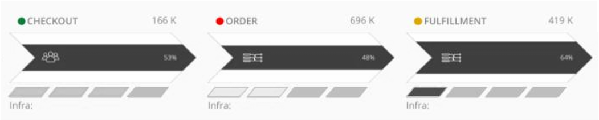

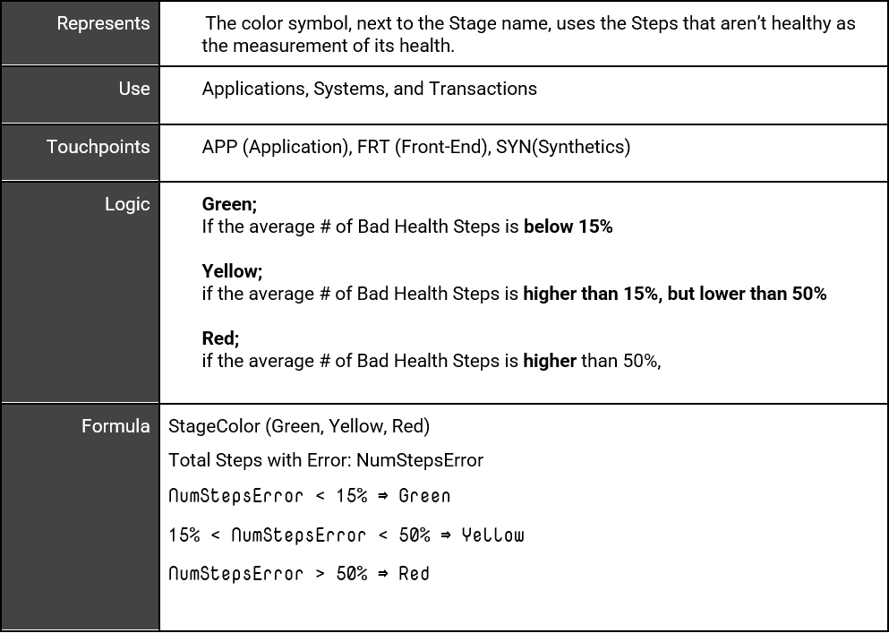

### CONGESTION

In a Stage, is represented by the blue arrow across the Stage; the greater the width of the arrow the more congested the Stage, the smaller the width of the arrow the less congested the Stage.

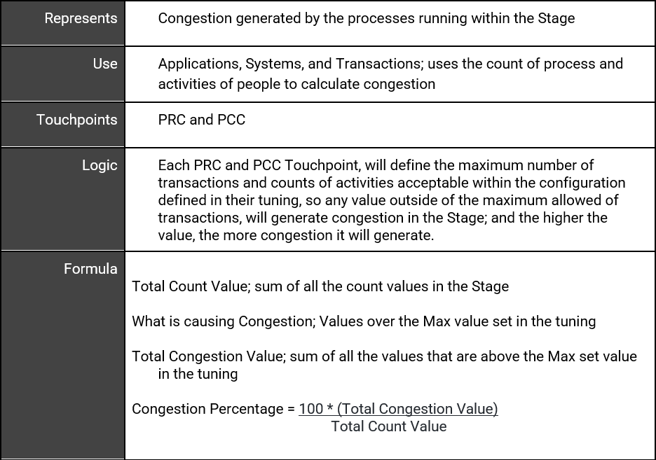

### INFRASTRUCTURE STATUS (WORKLOAD)

Shows the health of a Workload entity. A Workload has 4 stages that represent their health in general.

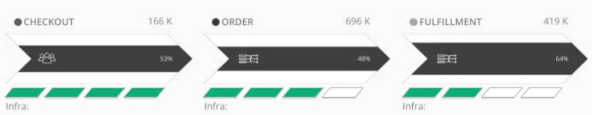

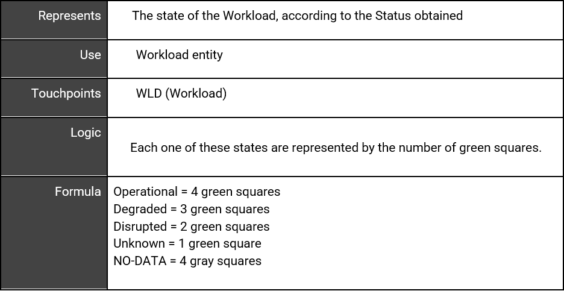

test3

