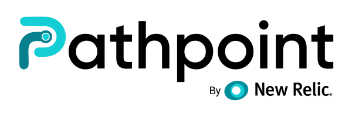

# Touchpoint Guide

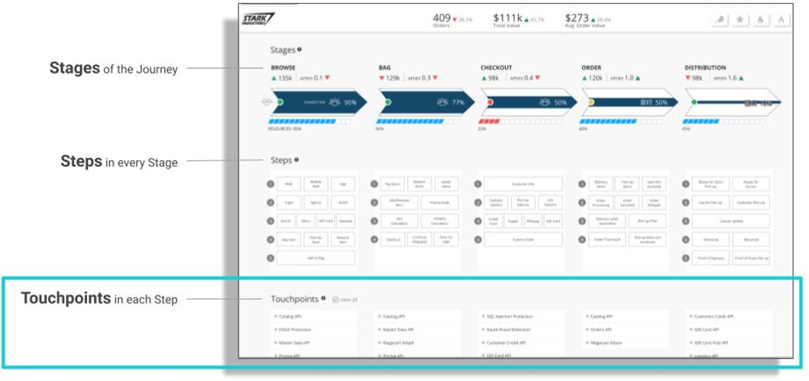

## Introduction

Touchpoints represent the current state of an Application, System, Transaction, Web Service, 
or User. This is achieved through NRQL Queries, Custom Tuning, and Links to a Dashboard or Telemetry Tool.  All of which can be accessed with a simple right-click

## Relation to STEPS

Touchpoints are linked to specific STEPs and as a result, determine their overall state.

●	Clicking on a particular Step will automatically highlight all related Touchpoints.  
●	Unhealthy or problematic Touchpoints will automatically highlight their related STEPs.   
●	One Touchpoint can be linked to multiple STEPS. 

## Coverage

Areas of Business and Operations that Touchpoints can cover.

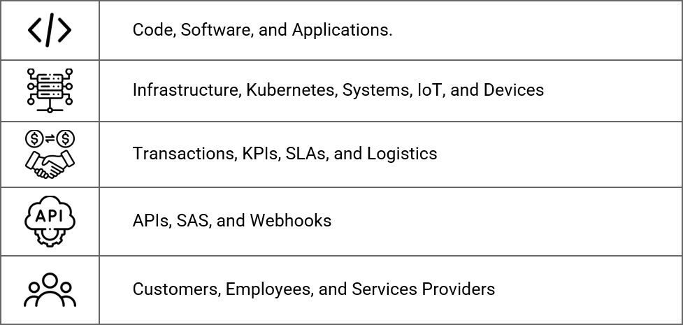

## Touchpoint Types

We categorize all Touchpoints by the following use types:

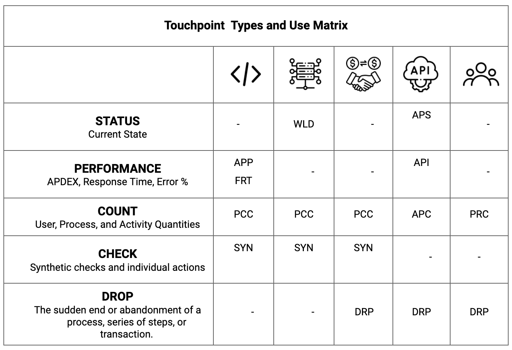

And, there are three different colors, for a Touchpoint state (on the left of the Touchpoint name), and they are:

* Green, the Touchpoint is healthy. 
* Gray, the Touchpoint needs attention.  
* Red, the Touchpoint is in a fail state.   
## Data Sources

Pathpoint is built on the New Relic Platform and makes use of all available data, tools, and services including APM, Browser, Synthetics, Logs, and FLEX. 

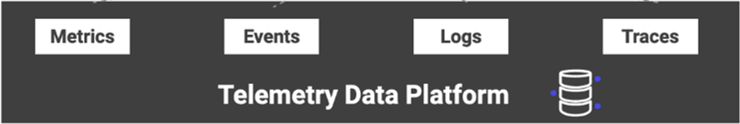

## Tuning

Touchpoint can be individually tuned via:

●	Min/Max  
●	Success %  
●	Apdex   
●	Errors %  
●	Duration Time  
●	Response Time  
●	Count  

Note: Tuning options change depending on the Touchpoint type.

## Queries

Touchpoints are powered by NRQL Queries:

●	You can Query Multiple accounts.  
●	Queries can be modified, customized, or completely replaced.  
●	Pre-Production Query Checks are integrated.  
●	Count.  
●	Session.  

Note: Queries have certain dependencies based on the specific Touchpoint.

## Links
Touchpoints may be linked to:

●	Custom Dashboards  
●	New Relic Tools  
●	External Page or Service  

## Standard Touchpoints:

### APP (APPLICATION)

PERFORMANCE Touchpoint  

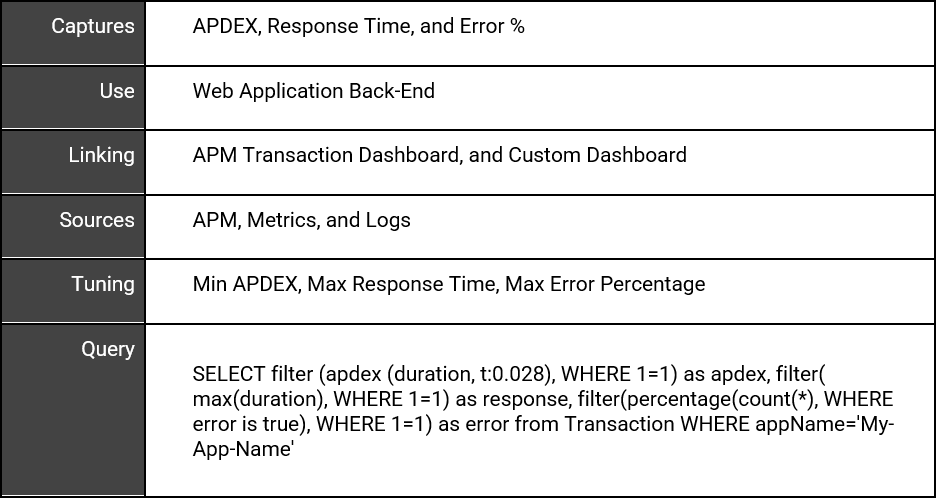

## FRT (FRONT-END)

PERFORMANCE Touchpoint

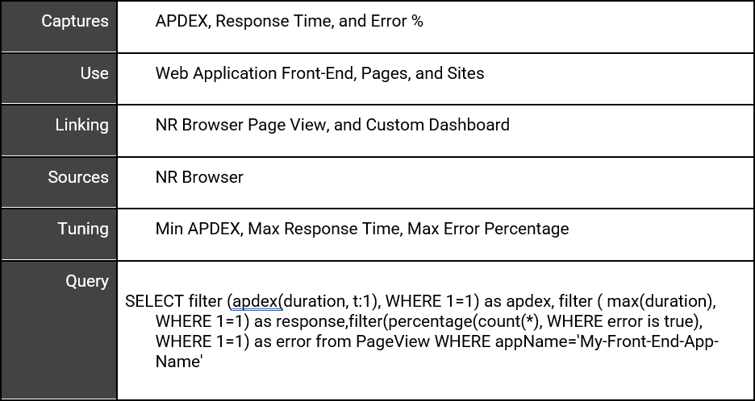

## PCC (PROCESS COUNT)

COUNT Touchpoint  

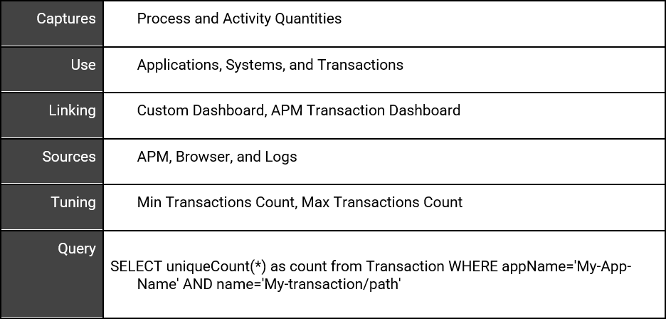

## PRC (PERSON COUNT)

COUNT Touchpoint

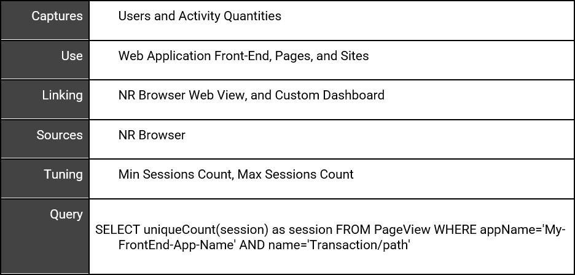

## SYN (SYNTHETICS)

CHECK Touchpoint

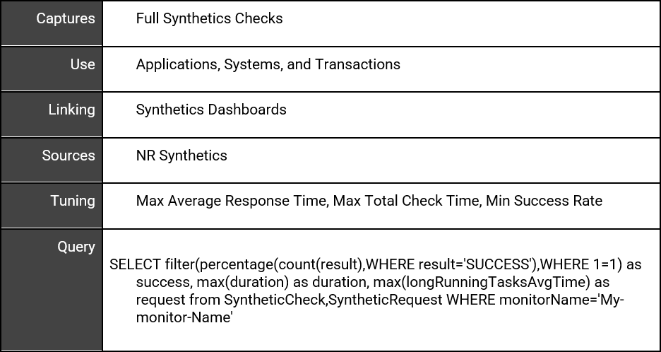

## WLD (WORKLOAD)

STATUS Touchpoint  

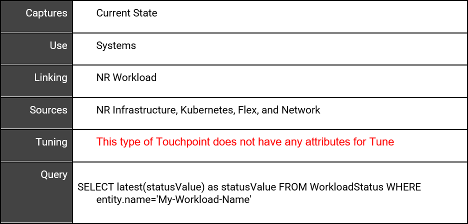

## DRP (DROP) 

DROP Touchpoint

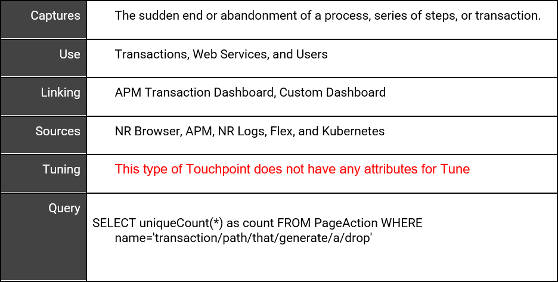

## API (API PERFORMANCE)  

PERFORMANCE Touchpoint  

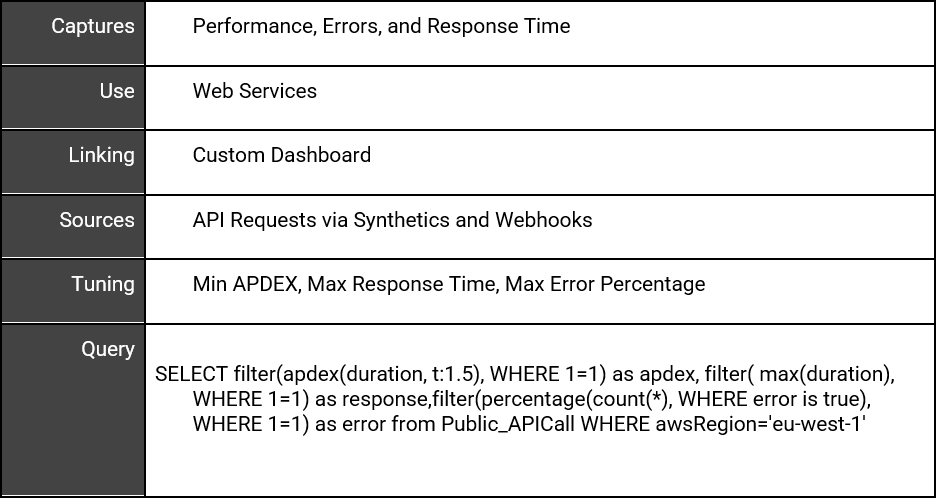

## APC (API COUNT)

COUNT Touchpoint  

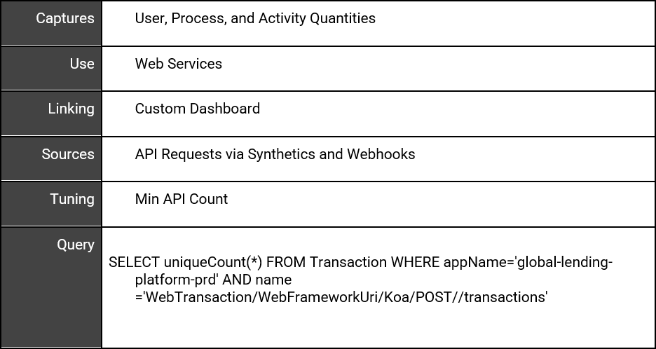

## APS (API STATUS)

STATUS Touchpoint

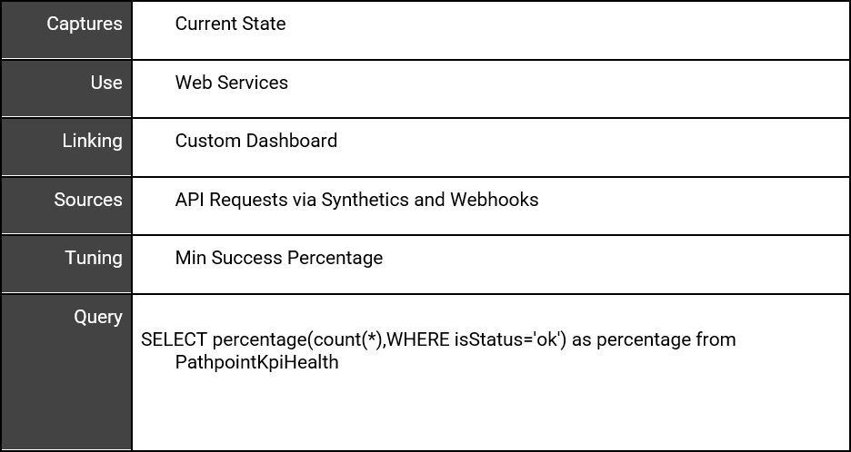
