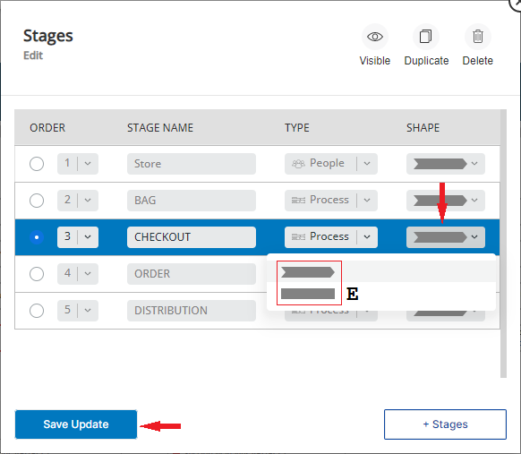
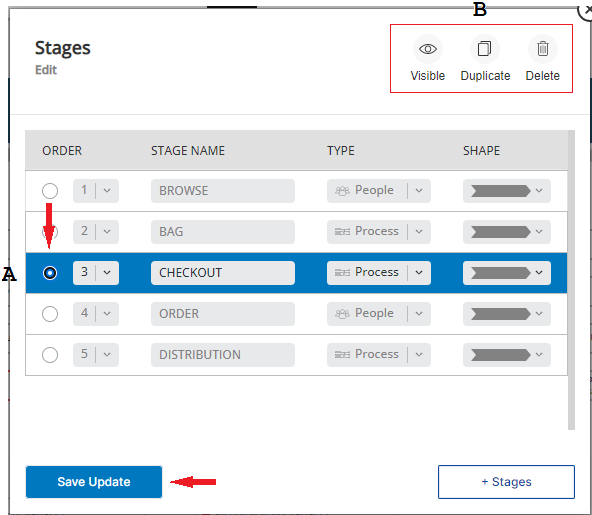

# Stages GUI Guide
Version 1.6.4
 
# Index ###
 

* ## [How to log in to your New Relic Pathpoint](#login) 
 * ## [Intro to the NEW GUI version of Pathpoint](#intro_to_gui) 
 * ## [How to work with the Logo feature of Pathpoint](#work_with_logo) 
 * ## [How to change the configuration of the Stages of your Pathpoint using its GUI](#work_stages) 
 * ## [How to change the type of a Stage](#type_of_stage) 
 * ## [How to change the Shape of a Stage](#shape_of_stage) 
 * ## [How to hide, duplicate, or delete a Stage](#hide_duplicate_delete) 
 * ## [How to add additional Stages to your Pathpoint](#add_stages) 
 

## How to log in to your New Relic Pathpoint ###
To login to your Pathpoint, open your web browser and type this URL; https://login.newrelic.com/login  in its address bar, and at the login prompt type: your username, click on Next, next type your password, and click on “Log in”.

Now, you must find the Pathpoint App the following way:

1. Click on the Apps icon, located on the top right-hand part of the screen.  
2. Now, look for the Pathpoint App; when you see it click on it, to open it.

Please note, that you might see a message the first time you log in to your New Relic account, asking you to confirm the use of data; to see and work with your Pathpoint, click on "Confirm".

## Intro to the NEW GUI version of Pathpoint ###

In this guide, written for users of version 1.6.4 of New Relic’s Pathpoint, you will see how to manually change/configure the Stages/Steps/Touchpoints and KPIs of your Pathpoint using its GUI (which allows you to make changes to the configuration of your Pathpoint mostly using your mouse), which is something that in previous versions of Pathpoint could only be done using a JSON configuration file. 

Now, to work with this NEW GUI version of Pathpoint, it has to have the GUI feature enabled.

To see if the Pathpoint has its GUI feature enabled, look for the grey settings button, to the right of either the Stages, Steps, Touchpoints, or KPIs name, if you see it, then this feature is enabled, if you don’t see it, then you can enable it, to use it. 

These are the steps to  enable the Pathpoint GUI feature: 

1. Click on the 3 lines, to the left of the Pathpoint logo.  
2. Next, in front of “GUI Editor”, click on the red “OFF” button (meaning the GUI is disabled), to enable it. Now you should see the GUI Editor button turn green. 
3. Finally click on the “X”, above “Setup”, to close this dialog box window.

Now, you can easily make changes to your Pathpoint configuration with your mouse using the instructions that follow, something that before version 1.6.4 was only possible using a JSON configuration file.

Return to top of [Index](#Index)
 
## How to work with the Logo feature of Pathpoint ###
In this version of Pathpoint, you can add or change the Logo of your Pathpoint App, to a new one. 

  
To change the logo, of your Pathpoint App, click on the Settings button, to the right of the Pathpoint logo. 
Now, a Windows dialog box window opens up, where you can make the changes necessary to select a new logo for your Pathpoint App.  

These are the steps to select a NEW logo or change the current one of your Pathpoint:

1. Click on the space, where it says “By URL”, and select the way you would like to change/add the Logo (the choices are: "By URL", "Text", or "Default"), for instance, to add it using the URL of an image you’ve saved/found on the internet, select “By URL”.
2. Now, click on the Dimensions space, and write/paste the URL of an image you’ve saved/found on the internet that you would like to use for the new logo (the dimensions of this logo have to be 45 x 27).  
3. Next, click on the “Save Update” button, to save your changes.

If you chose to use the URL method, and it linked to an image of the correct size, the new Logo should render on the Pathpoint GUI (if not fix it). You can change the Logo of your Pathpoint App as many times as you like. Now, if instead of URL, you chose to use "Text", as the logo, you can write up to 28 characters, and once you click on “Save Update” the text you’ve written, will replace the logo shown (if there was one).
 
Return to top of [Index](#Index)
## How to to change the configuration of the Stages of your Pathpoint using its GUI ###
Stages mark the principal parts of the Journey of a Pathpoint, and each Stage consists of Steps, touchpoints, and infrastructure workloads. In this version of Pathpoint, 1.6.4, you can create up to 10 Stages.

To start making changes to the Stages configuration of your Pathpoint using this NEW GUI version, click on the Settings button (to the right of the Stages name). Now, a dialog box window opens up, showing you the different options that you can use to change the configuration of the Stages of your Pathpoint.

 

This is the way to begin working with the configuration of the Stages area of your Pathpoint:    

A. Click on the select button, to the left of the Stage you want to work on, for instance, the “Browse” Stage, to select it.  
B. Now, click on the # under the “Order” section, if you wish to change the order of the Stage you selected. For instance, if the stage you chose is in order # 1, you can change it to be on order # 3, by selecting #3.  
C. If you wish to change the name of the Stage, while this window is open, click on the space for the name (use the Backspace key to remove it), and type the NEW name for the Stage.

Return to top of [Index](#Index)

## How to change the type of a Stage ###  

One of the most important changes that you can make to a Stage, is to change its type.

 

A There are two types of Stages in a Pathpoint:  

A. People type  
B. Process Type

In this GUI version of Pathpoint you can easily change the type of a Stage, from People to Process or vice versa.

At this point, if you wish to, you can also change the type of the Stage:   

D. To change the type of a Stage, for instance from “People” to “Process” or vice versa, click on the name you see under "Type", for instance, if the Stage says “People”, and you would like to change it to “Process”, click on “Process”.

To save any change you’ve made to the Stage configuration click on the “Save Update” button.

Return to top of [Index](#Index)

## How to change the Shape of a Stage ###

Likewise, if you wish to, you can also change the Shape of the Stage design, after selecting the Stage you want to work with.  

To change the Shape of the Stage, from Flow (Arrow towards the right) to None (Square):  

E. Click on the Shape shown, and select the one you want to use for your Stage, For instance, if the shape selected for this Stage is the Arrow towards the right, and you would like to change it to none, select the Square shape.

To save any change you’ve made to the Stage configuration click on the “Save Update” button.

Return to top of [Index](#Index)

## How to hide, duplicate, or delete a Stage ###
In this GUI version of Pathpoint is also very easy to Hide, Duplicate, or Delete a Stage, using just a series of clicks, and please remember that when you hide, duplicate, or delete a Stage, this also affects the Steps and Touchpoints under it.

To work with the Stages configuration of your Pathpoint using this GUI version, click on the Settings button (to the right of the Stages name). Now, a dialog box window opens up, showing you the different options you can use to change the configuration of the Stages of your Pathpoint.

To easily hide, duplicate, or delete a Stage, you have to:  

A. Click on the select guide, on the left side of the Stage name you want to work with. For instance the “Checkout” Stage.  
B. Now, click on the action you want to take, for instance, to hide a Stage, click on “Visible”. To duplicate a Stage, click on “Duplicate”, now a copy of that Stage will be created. For instance, if you chose to duplicate the Stage “Checkout”, a Stage named “Checkout copy” will be created (look for it at the bottom of the Stage list, you may need to use the scroll bar on the right, to see it). To delete a Stage, click on Delete.   
 
Later on, if you’ve previously chosen to hide a Stage, you can make this Stage visible again, by selecting it, and clicking on “Visible” (its icon will be of a reddish color). Now, the Stage as well as the Steps and Touchpoint under it will be visible. If you chose to Delete a Stage, you must click on “Confirm”, to delete it, which will also include the Steps and Touchpoints under it.  Finally, you must click on the “Save Update” button, to save any change you’ve made.

Return to top of [Index](#Index)

## How to add additional Stages to your Pathpoint ###
In this version of Pathpoint, you can add additional Stages to your Pathpoint, up to a total of 10. 

To begin adding a Stage to your Pathpoint, click on the Settings button, to the right of the Stages name.

 

These are the steps to add additional Stages to your Pathpoint:  
1. Click on “+ Stages”.  
2. Scroll down, using the sidebar to see the new Stage, at the bottom of the list of Stages.  
3. Click on the new Stage, to select it.  
4. Click on the “New Stage” label, delete it, and type its NEW name, for instance; “Test Stage”.
 

If you wish -at this point- you can also change the type of the Stage (the choices are “People” or “Process”), by clicking on the type of Stage shown and selecting a different type, for instance, if the default type for the NEW Stage is “People”, and you would like to change it to “Process”, click on the Stage type name shown (People) and select “Process”.

You can also change the Shape of the NEW Stage, from Flow (Arrow towards the right) to None (Square), by clicking on the Shape shown, and selecting the one you want to use for your Stage, for instance, if the shape of your Stage is the Arrow towards the right, and you would like to change it to none, select the Square shape.  To save your changes click on “Save Update”.

Now, you can see the NEW Stage, “Test” Stage, on this sample Pathpoint, which I also chose to place between the “Bag” and “Checkout” Stage, by choosing it to be on order # 3. In addition to this change, I also changed the shape of the Test Stage, from the Arrow to the right, to the Square shape.

Return to top of [Index](#Index)