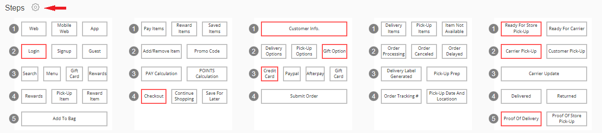
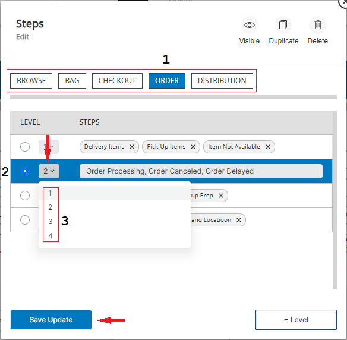
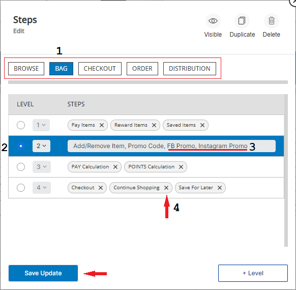
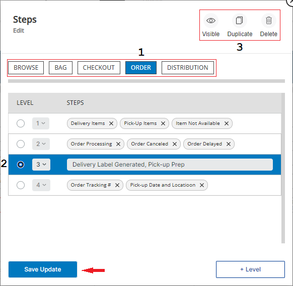
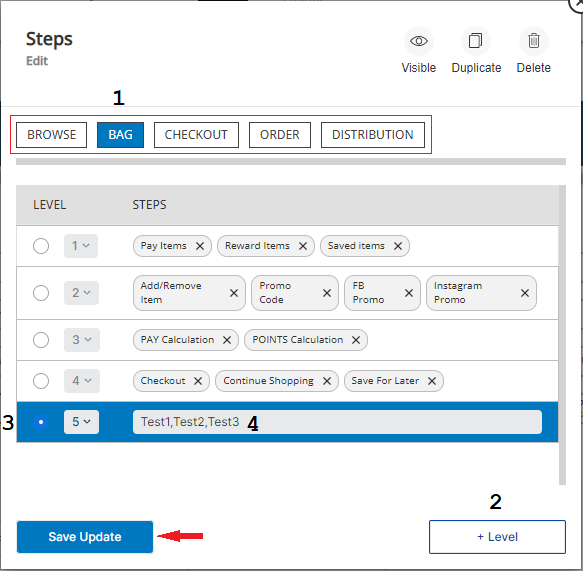

# Steps GUI Guide
Version 1.6.4
 
# Index ###

* ## [How to to change the configuration of the Steps of your Pathpoint  using its GUI](#steps) 
* ## [How to change the order level of a line of Steps](#Steps_order_of_steps) 
* ## [How to add more steps to a line of Steps](#add_line) 
* ## [How to Hide, Duplicate or Delete a line of Steps](#hide_duplicate_delete) 
* ## [How to add a NEW level of Steps](#new_line) 

## How to change the configuration of the Steps of your Pathpoint using its GUI ##
Steps represent the various actions/events occurring throughout the stage. They can be placed in the traditional sequential manner of steps 1,2,3.., but also in a parallel form to represent optional and simultaneous actions and activities. The title of the Step corresponds to the name with which the Step is identified.  And every Step of a Pathpoint is connected to one or more Touchpoints and Every Stage Status is based on the culmination of its respective Touchpoints.

To begin making changes to the Steps configuration of your Pathpoint, click on the Settings button (to the right of the Steps name).

Now, a dialog box window opens up, which will help you change the configuration of the Steps of your Pathpoint.

Return to top of [Index](#Index)

## How to change the order level of a line of Steps ###
This is something that before this version of Pathpoint, 1.6.4, could only be done using the JSON configuration file, now the same thing can be accomplished with a few clicks of the mouse.
 

This is the way to work with the configuration of the Steps, to change the level # of a line of Steps: 
 
1. Begin by selecting the Stage under which you would like to work, for instance, “Order”.  
2. Now, select the level of the Steps you would like to change, for instance, the second one. 
3. Click on the # shown on the level line, if you would like to change it to a different #. For instance, if the line of Steps is the second one, click on the number you see and change it to another one, for instance, select line # 3, which moves the whole line of Steps from the second line to the third position of Steps.  
 
To save these changes click on “Save Update”. Later on, you can change this line, to another level, or change to the original level, in this case, level # 2.

Return to top of [Index](#Index)

 ## How to add more steps to a line of Steps ###
 
 
In a Pathpoint you can have up to 10 Steps, under any one line of Steps. And you can add additional Steps to a line, using the NEW GUI editor or a JSON configuration file.
 
To start making changes to the Steps configuration of your Pathpoint, click on the Settings button (to the right of the Steps name).
 

 
This is the way to add additional Steps, to a line of Steps:  
 
1. Begin by selecting the Stage under which you would like to work, for instance, “Bag”.
Now, click on the line of Steps you want to add more Steps to, to select it.   
2. For instance, line # 2.  
3. To add more Steps to this line, click at the end of the list of Steps you see here, type a comma, and manually type the name of each one of the Steps (type a comma after each name), you would like to add to this line of Steps. Please note, that you can easily remove a Step, while you are working on adding more Steps, by placing the cursor to the right of the name of the Step you would like to remove, clicking, and using the Backspace key to remove its name.   
4. To easily remove a Step, on a different level than the one you’ve selected, click on the X next to its name.
 
To save the changes you’ve made, click on “Save Update”. Later on, you can use these instructions, to add additional Steps to a line of steps, up to 10, or remove one or more Steps you’ve previously added.

Return to top of [Index](#Index)

## How to Hide, Duplicate or Delete a line of Steps ###
 
In this version of Pathpoint you can easily hide, Duplicate, or Delete a line of Steps, with just a few clicks of your mouse. 

As you saw before, to begin making changes to the Steps configuration of your Pathpoint, click on the Settings button (to the right of the Steps name). 

These are the steps to hide, duplicate (which copies a whole line of Steps), or delete a line of Steps:

1. Begin by selecting the Stage under which you would like to work on, for instance, “Order”.  
2. Now, select the line of the Steps you would like to work on, for instance, the third one.  
3. Next, click on the action you want to take, for instance, to hide a line of Steps, click on “Visible”, to hide it. To duplicate a line of Steps, click on "Duplicate", now a copy of that line of Steps will be created, at the bottom of the last line of Steps (you might need to use the scrolling slider on the right to see it). To delete a line of Steps, click on Delete. 

Keep in mind that when you choose to delete a line of Steps you will be asked to confirm that that is really what you want to do; to delete it, click on the “Confirm” prompt.  Finally, you must click on the “Save Update” button, to save any changes you’ve made. 

Later on, if you wish to make a line of Steps you've chosen to hide, visible again, return to the same line of Steps, and click on the red “Visible” icon, to make it visible again.

Return to top of [Index](#Index)

## How to add a NEW line of Steps ###
 
In this version of Pathpoint, you can easily add a NEW line of Steps using the GUI. Please keep in mind that in a Pathpoint you can have up to 7 levels of Steps, under a particular Stage.

To start making changes to the Steps configuration of your Pathpoint, click on the Settings button (to the right of the Steps name).

These are the steps to add a completely NEW line of Steps:  

1. The first step, before making any changes to the Steps configuration, is to select the Stage under which you would like to work, for instance; “Bag”.  
2. Now, click on “+ Level”, which creates a completely NEW Line of Steps at the bottom of the list of Steps (You might need to click down on the scrolling guide on the right, to see this NEW line of Steps)  
3. Click on the new line that you’ve created, to select it.  
4. Next, click inside the new line, and type the name of each NEW Step (type a comma after each name), you would like to Add to your Pathpoint. You can also remove a Step, while you are working on adding more Steps, by placing the cursor to the right of the name of the Step you would like to remove and using the Backspace key to remove its name.   

Finally, you must click on the “Save Update” button, to save any of the changes you’ve made.

Return to top of [Index](#Index)

