# Steps Guide

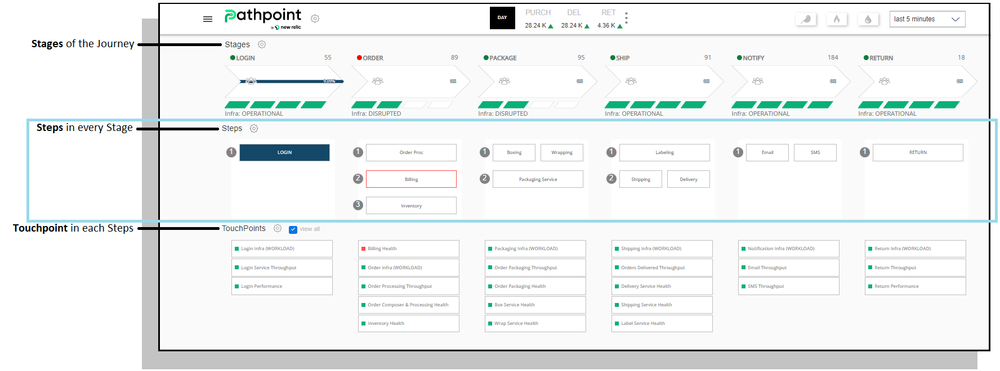

# Introduction

Steps represent the various actions/events occurring throughout the stage. They can be placed in the traditional sequential manner of 1,2,3.., but also in a parallel form to represent optional and simultaneous actions and activities.

## Types of Steps:

* Opening Steps 
* Transitional Steps 
* Closing Steps 

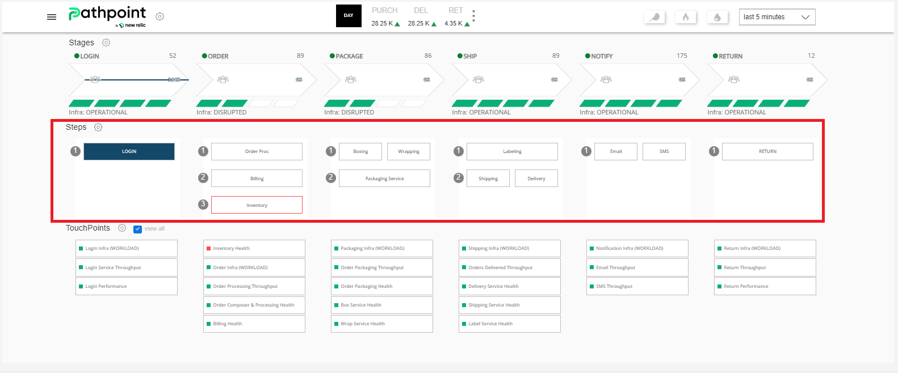

In this example, you can see six Stages, and under each Stage, rows of Steps, showing you the 3 different types of Steps, which can be easily identified by their label, for instance: “Login” (Opening Step), “Order proc” (Transitional Step), and “Delivered” (Closing Step).

## Levels

Levels establish order flow and sequence for steps. 

Pathpoint allows for up to 7 Steps per level and 7 Levels per Stage.

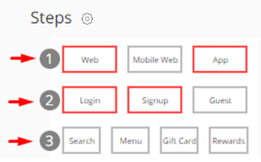

## Steps

Steps can represent various functions in the flow. Places to start, mandatory areas, optional parts, and points of completion. 

### Opening Steps: 

Opening steps can represent Home/Landing pages, Welcome Mats, or even loading screens. They are points of entry that are found throughout your sites, mobile apps, and enterprise tools.

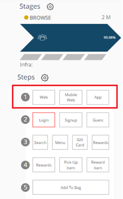

In this example the first line of Steps, under the “Browse” Stage, denotes the beginning steps when someone starts the process of thinking of buying something online, so the 3 steps in the first row of Steps are: “Web”, “Mobile Web”, and “App”, meaning someone needs an internet connection, a Smart device, and an App to start the purchase.

### Transitional Steps 

Between the Opening and Closing steps, we find the Transitional steps. These steps are used to bridge the actions, options, and functional parts between each Level.

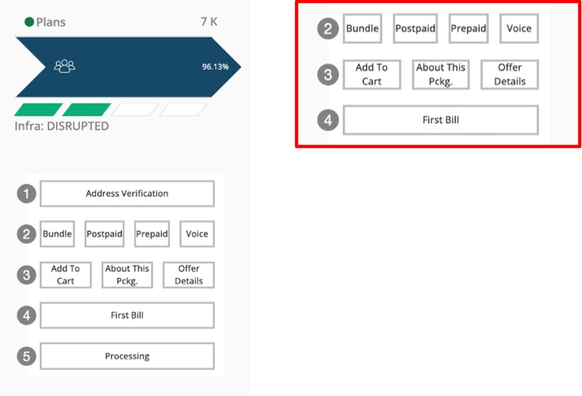

### Closing Steps 

The stage level end goal or result is the closing step. Signup is completed, a form submitted, an action is confirmed, or a product has been shipped, these are all examples of closing steps. 

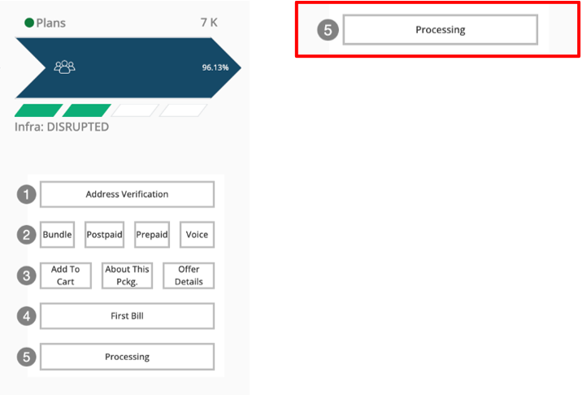

## Flow

###  Uni-Flow

When stages consist of 1 step per level, we call this a uni-flow. Every step is mandatory and must occur one after the other. 

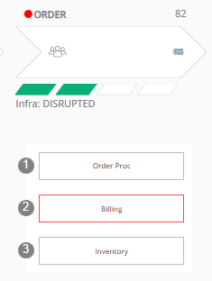

### Multi-Flow

When multiple steps are found within singular Levels, a Multi-Flow stage is created.

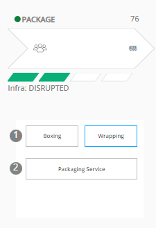

We describe these multiple steps as Parallel Steps.  They can represent options, actions, or states that can happen in parallel. These steps are usually viewed from left to right, to establish popularity and priority.

# Status

### Step Health

When a Touchpoint experiences an error or performance issue, every Step it is mapped to, will be highlighted with a red border. This border disappears when the issue is resolved.

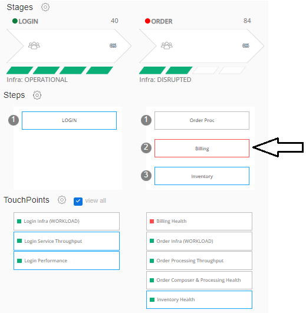

### Stage Health 

The Green, Yellow or Red light to the left of the STAGE name represents Stage Health. The light changes based on the combined health status of every step.  

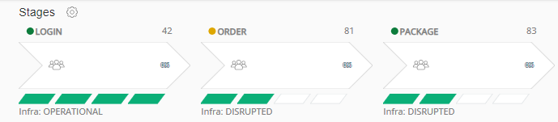

## Congestion

When a Step exceeds a predefined threshold, it contributes to the overall congestion of the Stage. This is represented by the amount of blue within the Stage Arrow:

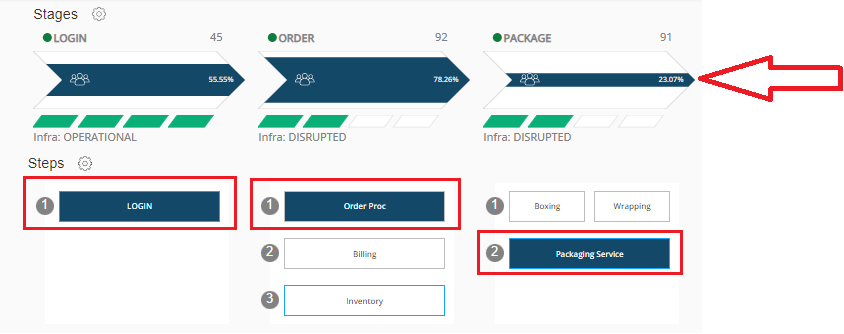

By clicking on the arrow of the Stage, Pathpoint will highlight the Step that is creating most of the congestion.

