   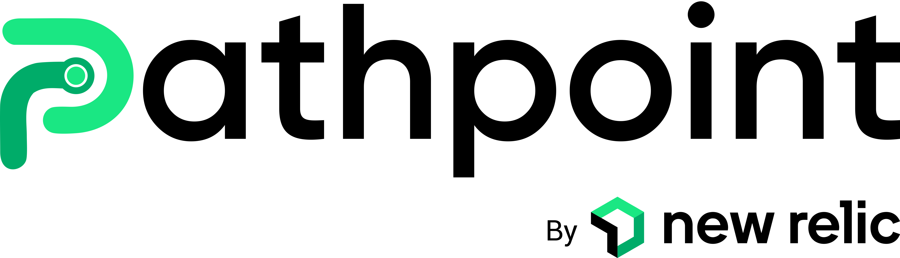           
           
New Relic Pathpoint is an enterprise platform tracker that models system health in relation to actual user-impacting the different business stages, and on this documentation you will learn the different concepts of a Pathpoint,  as well as how to interact with the Pathpoint configuration, like for example how to tweak the different Touchpoints of a Pathpoint, to better visualize the data you are most interested in tracking.

 # Main Index ###
 

 * ## [Pathpoint Concepts](#Pathpoint_Concepts)

     *   [Stages](#Stages) 
   *   [Steps](#Steps)
   *   [Touchpoints](#Touchpoints)

* ## [Pathpoint Configuration](#Pathpoint_Configuration)

   * ## [JSON Configuration File](#JSON_Configuration_File)

     
        * [Setting up KPI queries](#Setting_up_KPI_queries)
      * [Setting up Stages & Steps](#Setting_up_Stages_Steps)

    * ## [Touchpoint Types](#Touchpoint_Types)     

      *  [APP (APPLICATION)](#APP)  
      *  [FRT (FRONT-END)](#FRT)  
      *  [PCC (PROCESS COUNT)](#PCC)  
      *  [PRC (PERSON COUNT)](#PRC)   
      *  [SYN (SYNTHETICS)](#SYN)  
      *  [WLD (WORKLOAD)](#WLD)  
      *  [DRP (DROP)](#DRP)  
      *  [API (API PERFORMANCE)](#API)  
      *  [APC (API COUNT)](#APC)  
      *  [APS (API STATUS)](#APS)   

   	
    * ## [Working with Touchpoints](#working_with_touchpoints)

         * [How to test a Touchpoint](#Test_a_Touchpoint)  
      * [Setting up Touchpoints](#Setting_up_Touchpoints)   
       * [Tune Touchpoint Thresholds](#Tune_Touchpoint_Thresholds)
       * [How to turn off a Touchpoint](#Disable_a_Touchpoint) 
       * [How to run Touchpoint Queries](#How_to_run_touchpoing_queries)

   * ## [Configure Logging](#Configure_Logging)

 
* ##  [Using Special Filters](#Using_Special_Filters)

   *   [Canary Filter](#Canary_Filter)
   *  [Flame Filter](#Flame_Filter)
   *  [Drop Filter](#Drop_Filter)

# Pathpoint Concepts ###

Business Journey Observability, is the Customer, Product and Services Paths, including all Internal Processes & External Dependencies, needed to meet a customer’s expectation and or service agreement. Pathpoing is Business Journey Observability.

 Pathpoint will work in nearly any New Relic account. And each Pathpoint is divided into; Stages, Steps and Touchpoints.

To get started setting up Pathpoint you'll need some telemetry in the account that you would like to measure. This could be -for instance- any of the following telemetry types: 

 Metrics, Events, Logs and Traces. 

A common starting place for Pathpoint is APM Events and Logs, but this is up to you. The other thing you'll need to know is how this telemetry maps onto the business process you want to model as stages and steps. That may require some internal discussions with your stakeholders to understand how things really fit in.

To configure your own Pathpoint simply download the current version of the JSON config that was written for you, to edit it yourself (if you wish to do so) and then re-upload it. Alternatively you can also manually "right click" over each one of the touchpoints you would like to work on, to manually adjust its configuration.

Return to top of [Index](#Index)

## Stages ###

Stages are the principal parts of the Journey. They are defined as either a Person or a Process Stage and are designed to show the complete health, congestion, count and Infrastructure state of a Pathpoint. 

The different Stages of a Pathpoint, will allow you to see the business processes at a high level, and notice how for each commercial stage, different services and methods are presented at the system level. Based on business information, PathPoint previews latency indicators.

And the information related to a particular stage, including the errors for each one of them, can be viewed in REAL TIME at a high level. And for each particular stage we can see first-hand if any of its associated touchpoints are critical, and if this is the case, then the stage will turn yellow. If it stays green, it means that everything is working normally.  But if instead, the stage turns the color red, it means that all its touchpoints have anomalies that need to be resolved. 

On the following graphic, you can see that this particular Pathpoint has five stages in process.

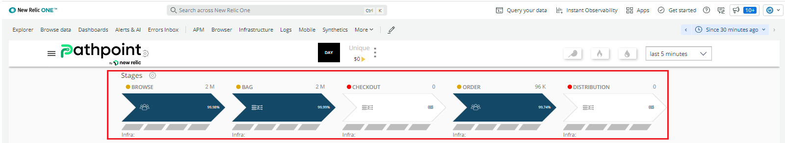

Additionally if the Stage turns blue, like in the example above, this represents congestion on the Stage, and if the color of the Stage is white, it means it is free of congestion.

 Please note that under a single Stage you should only count either persons (PRC Touchpoint) or processes (PCC Touchpoint).

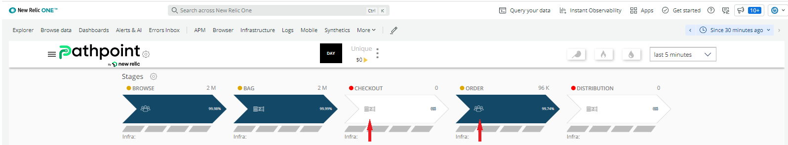
 On the graphic above you can see the symbols for the two types of Stages, which are:  

    A The one to count Processes  
    B And the one to count People
    
Each Pathpoint Stage is defined, to either count People or Proceses, by the Touchpoints under the Steps they have, so if a Step, under a Stage, has Touchpoints of the PCC (Process count), then the Stage will show the Process count symbol. Likewise, if a Step, under a Stage, has Touchpoints of the PRC (People count) under it, then the Stage will show the People count symbol.

## Steps ###

Steps represent the various actions/events occurring throughout the stage. They can be placed in the traditional sequential manner of step 1,2,3.., but also in a parallel form to represent optional and simultaneous actions and activities. 

Title: Corresponds to the name with which the Step is identified. In this example; "Customer info."

On the next example graphic you can see the row in which each task is located within the Step.

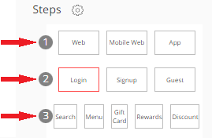

Values: Indicate the parameters for each step;  
* Currently in line 1) "Web", "App", and in line 2)"Login"  and "Signup" are being considered, and in line 3) Search, Menu, Gift Card, and Rewards aren't being considered.

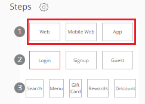

ID: Corresponds to the code that identifies the step in its order within the row that is located. For the example, in line 1 the "Web" step is assigned the order # 1, the "Mobile Web" step has the order # 2 assigned and the "App" step is assigned the order # 3 in its configuration.

## Touchpoints ###

Touchpoints are the more granular entities of the PathPoint model. TouchPoints do behave more like a specific browser application or APM (Application Monitor). 

 Touchpoints do also hold individual Health, Status, Performance, Count and even Business knowledge of a specific data object, environment, app, device, API or service. Additionally every Touchpoint can be tuned and modified to fit a specific journey’s goal.

And every Step of a Pathpoint is connected to one or more Touchpoints and Every Stage Status is based on the culmination of its respective Touchpoints. The Touchpoint is the pulse of each Pathpoint.

There are three different colors, for a Touchpoint state (on the left of the Touchpoint name), and they are:

* Green, the Touchpoint is healthy.  
* Gray, the Touchpoint needs attention.  
* Red, the Touchpoint is in a fail state.

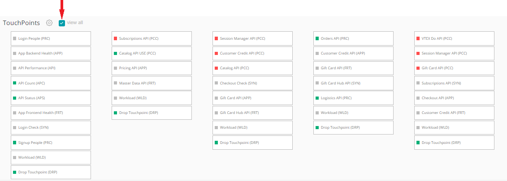

Please note that by default you will only see the Touchpoints that aren't healthy in your Pathpoint, and that to see all of the Touchpoints, you can click on "View all". 

On the next example graphic you can see a Touchpoint.

* Title: Corresponds to the name that identifies the touchpoint.

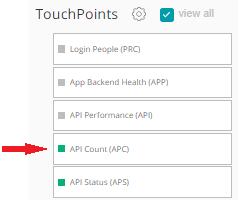

In this example the Touchpoint name is "API Count (APC)", and the APC means that this is the type of Touchpoint designed to count processes. 

* Status "On" or "Off": This option allows you to enable or disable a touchpoint for display mode. 

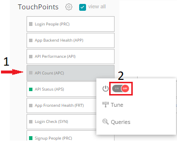

To turn Off a Touchpoint (for instance to troubleshoot it): 1) Right click on its name, then 2)lick on the "On" button. To turn it back "ON", right click on the Touchpoint again and click on the "OFF" button.

* Related_steps: Indicates the Step to which a Touchpoint is associated with. 

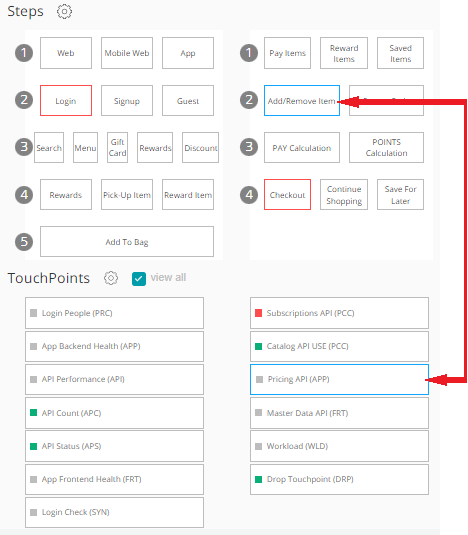

In this example, the "Pricing API (APP)" Touchpoint is linked to the "Add/Remove Item" Step.

* Queries: Allow you to determine all the parameters that of a particular Touchpoint should consider. They are pre-programmed on a file called JSON configuration file, and you can also manually tweak them to fit a specific journey’s goal.

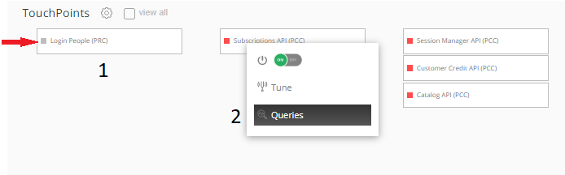 

To see a particular Touchpoint query: 1) Right click on the particular Touchpoint you want to work with, and then 2) click on  "Queries".  

These are the different parts of the query box window, of a PRC person count Touchpoint:

     1 Type: Identify the right type of query, according to the type of Touchpoint.
     2 AccountID: Determines the account with which the query is identified.
     3 Query: Displays the actual query that determines the behavior of the Touchpoint. 
     4 Query_timeout: Determines the maximum time of activity in which the query will be executed.
     5 Min_count: The query will present a minimum of X number of records.
     6 Measure_time: Determines the time from when you want the query to collect information to perform the measurement.

 In this Readme file you will learn more about the different types of queries, for the different types of Touchpoints.   

And these are two examples of a typical Touchpoint configuration, as is written on the JSON file:

Example 1

Example 2

Please note, that there is a recommendation that when you give a Touchpoint its name, also state the type of Touchpoint it is, like for example the Touchpoint VTEX Do API, name it like this; "VTEX Do API(PCC)", which tells the person looking at the Touchpoint, at a later time, that this is a PCC Touchpoint, intended to count processes.

# Pathpoint Configuration ###

Pathpoint is configured using a JSON configuration file, which is written to the needs of your particular business. Once the configuration file is loaded, you can also manually tweak the Touchpoints, tuning them, or working with their queries. This information will be shown to you further down in this Readme file.

## JSON Configuration File ###

JSON for its acronym (JavaScript Object Notation) is a data structure, whose basic function is to allow for the exchange of information. Through this structure it will be possible to identify each of the elements and components that will facilitate the implementation of Pathpoint, knowing the function of its attributes, queries and data output. To program new Stages, Steps and Touchpoints, you upload a New JSON Configuration file.

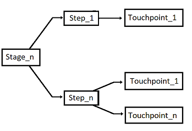

The graphic above shows you how each Stage can be tied to a few Steps, which in turn can be linked to a single Touchpoint, or to a few Touchpoints.

## Uploading a New JSON Config File

Once you are given the JSON configuration file, you can Upload it to your Pathpoint.

  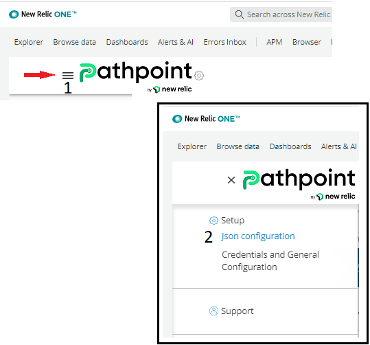

 To load a new JSON configuration file use the following steps:

  1 To begin, once you are on the Pathpoint screen, click on the three lines on the top left part of the window.  
2 Now, click on the option "JSON Configuration".

3 On the dialog box window that opens up, type -under "Description"- a memo that will remind you later why you chose to upload a new JSON configuration file. There is also a space for a Note, write the current date or something else. Now, to start this process, click on "From File".

4 Next, locate the JSON configuration file you want to use to update your Pathpoint and click on "Open"

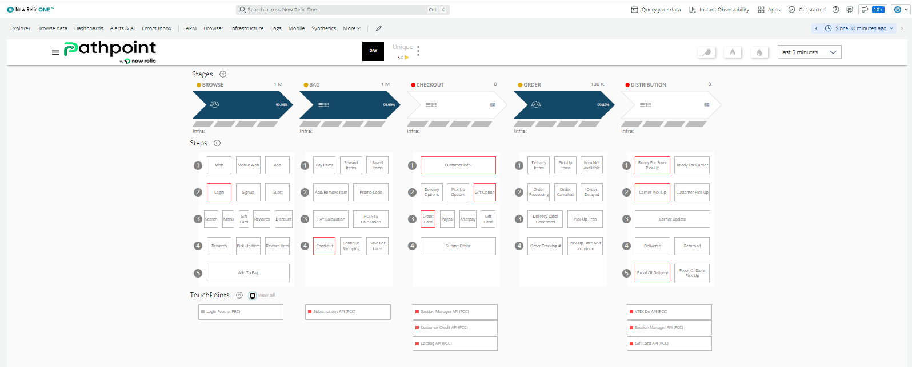

5 Finally, the Pathpoint is displayed with the updates of the particular JSON file you chose.

## How to download the Currently Active JSON Config File

Similarly, Pathpoint offers you the possibility of downloading the current JSON configuration file, to your computer, if for instance you wish to make changes to it. 

And these are the steps to download, to your computer, the current JSON configuration file:

1 To begin, once you are on the Pathpoint screen, click on the three lines on the top left part of the window.  
2 Now, select the option "JSON Configuration".

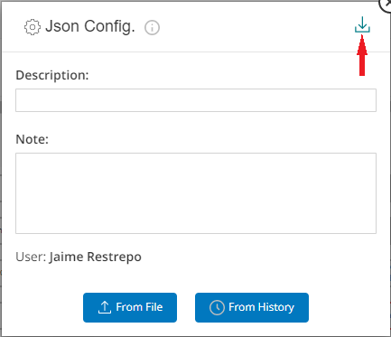

3 Next, click on the arrow down, to download the current JSON configuration file.

4 Finally the JSON configuration file is downloaded to your computer (in Google Chrome you will see the file at the bottom of the browser), and now you can work on it.

## Setting up KPI queries ##

KPI by its acronym (Key Performance Indicator), are normally known as key indicators, which allow you to view the performance of a process. In the case of Pathpoint, KPIs fulfill a fundamental function, which is the measurement of specific indicators within a particular process.  Pathpoint allows for the configuration of several `ad hoc` KPIs to be shown in the top banner.  These are optional.  To omit them just configure your KPIs section to an empty list like this; "kpis": []

- Structure KPI

Where:

Type: Defines the type of measurement to be performed, which can be:
-- "100" returns the current measurement value.
-- "101" returns the current value and compares it with the value of "X" previous days

* Name: Corresponds to the long name of the KPI.
* ShortName: Corresponds to the short name of the KPI.

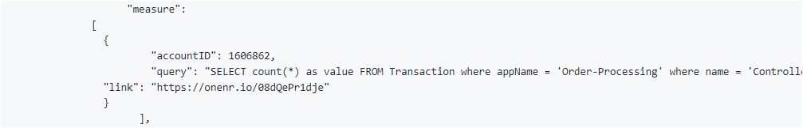

* Measure: The data that allow the measurement to be made is displayed.
* accountID: Corresponds to the number that identifies the measurement performed.
* Query: Corresponds to the query that is used to perform the measurement.

* Link: Corresponds to the link that directs to the KPI dashboard.

* Value_type: It can be an integer value "INT" (example: 712) or a decimal value "FLOAT" (example: 712.25).

* Prefix: It is used in the case in which you want to Identify the KPI by placing a symbol or letter at the beginning of the name. Example: $.
* Suffix: It is used in the case where you want to Identify the KPI by adding a symbol or letter at the end of the name. Example: M%.

Return to top of [Index](#Index)

# Touchpoint Types ### 

As you saw before, a New Relic Pathpoint does have different types of Touchpoints, which are adapted according to the needs of each business, and they are: 

* APP (APPLICATION), PERFORMANCE Touchpoint; used to measure the health of the back-end of your APP   
* FRT (FRONT-END), PERFORMANCE Touchpoint; used to measure the health of the front-end of your APP 
* PCC (PROCESS COUNT), COUNT Touchpoint; used to count processes
* PRC (PERSON COUNT), COUNT Touchpoint; used to count people 
* SYN (SYNTHETICS), CHECK Touchpoint; used to assess the health of a Synthetic monitor  
* WLD (WORKLOAD), STATUS Touchpoint; used to find out the status of a Workload 
* DRP (DROP), DROP Touchpoint; used to assess the status of a Drop Filter,  
* API (API PERFORMANCE), PERFORMANCE Touchpoint; used to gauge the performace of an API 
* APC (API COUNT), COUNT Touchpoint, used to count user, proceses, and the quantity of activities 
* APS (API STATUS), STATUS Touchpoint; used to find out the status of an API

There are three different colors, for a Touchpoint state (visible on the left of the Touchpoint name), and they are:

* Green, the Touchpoint is healthy
* Gray, the Touchpoint needs attention
* Red, the Touchpoint is in a fail state.

## Tuning

Touchpoint can be individually tuned via:

● Min/Max  
● Success %  
● Apdex  
● Errors %  
● Duration Time  
● Response Time  
● Count  

Note: Tuning options change depending on the Touchpoint type.

## Queries 
Touchpoints are powered by NRQL Queries: 

● You can Query Multiple accounts.  
● Queries can be modified, customized, or completely replaced.  
● Pre-Production Query Checks are integrated.  
● Count.  
● Session.  

Note: Queries have certain dependencies based on the specific Touchpoint.  

## Links  
Touchpoints may be linked to:  

● Custom Dashboards  
● New Relic Tools  
● External Page or Service  

Now, you will see the details for each type of Touchpoint:

## APP (APPLICATION)) ### 

PERFORMANCE Touchpoint

Captures;

* APDEX, Response Time, and Error %

Use;

* Web Application Back-End

Linking;

* APM Transaction Dashboard, and Custom Dashboard

Sources;

* APM, Metrics, and Logs

Tuning;

* Min APDEX, Max Response Time, Max Error Percentage

Query;

* SELECT filter(apdex(duration, t:0.028), WHERE 1=1) as apdex, filter( max(duration), WHERE 1=1) as response,filter(percentage(count(*), WHERE error is true), WHERE 1=1) as error from Transaction WHERE appName='My-App-Name'

Return to top of [Index](#Index)

## FRT (FRONT-END)) ### 

PERFORMANCE Touchpoint

Captures;

* APDEX, Response Time, and Error %

Use;

* Web Application Front-End, Pages, and Sites

Linking;

* NR Browser Page View, and Custom Dashboard

Sources;

* NR Browser

Tuning;

* Min APDEX, Max Response Time, Max Error Percentage

Query;

* SELECT filter(apdex(duration, t:1), WHERE 1=1) as apdex, filter( max(duration), WHERE 1=1) as response,filter(percentage(count(*), WHERE error is true), WHERE 1=1) as error from PageView WHERE appName='My-Front-End-App-Name'

## PCC (PROCESS COUNT)) ###

COUNT Touchpoint

Captures;

* Processes and Activity Quantities

Use; 

* Application, Systems, and Transactions

Linking;

* Custom Dashboard, APM Transactions Dashboards

Sources;

* APM, Browser, and Logs

Tunning;

* Min Transactions Count, Max Transactions Count

Query;

* SELECT uniqueCount(*) as count FROM Transaction Where appName='My-App-Name'AND name='My-transaction/path'

Return to top of [Index](#Index)

## PRC (Person Count) ### 

Count Touchpoint

Captures;

* Users and Activity Quantities

Use; 

* Web Aplication Front-End, Pages, and Sites

Linking;

* NR Browser Web View, and Custom Dashboard

Sources;

* NR Browser

Tunning;

* Min Sessions Count, Max Sessions Count

Query;

* SELECT uniqueCount(session) as sessions FROM PageView WHERE appName='My-FrontEnd-App-Name' name='Transaction/path'

Return to top of [Index](#Index)

## SYN (SYNTHETICS)) ### 

CHECK Touchpoint

Captures;

* Full Synthetics Checks

Use;

* Applications, Systemss, and Transactions

Linking;

* Synthetics Dashboards

Sources;

* NR Synthetics

Tuning;

* Max Average Response Time, Max Total Check Time, Min Success Rate

Query;

* SELECT filter(percentage(count(result),WHERE result='SUCCESS'),WHERE 1=1) as success, max(duration) as duration, max(longRunningTasksAvgTime) as request from SyntheticCheck,SyntheticRequest WHERE monitorName='My-monitor-Name'

Return to top of [Index](#Index)

## WLD (WORKLOAD)) ### 

STATUS Touchpoint

Captures;

* Current State

Use;

* Systems

Linking;

* NR Workload

Sources;

* NR Infrastructure, Kubernetes, Flex, and Network

Tuning;

* This type of Touchpoint does not have any attributes for Tuning.

Query;

* SELECT latest(statusValue) as statusValue FROM WorkloadStatus WHERE entity.name='My-Workload-Name'

Return to top of [Index](#Index)

## DRP (DROP)) ### 

DROP Touchpoint

Captures;

* The sudden end or abandonment of a process, series of steps, or transaction.

Use;

* Transactions, Web Services, and Users

Linking;

* APM Transaction Dashboard, Custom Dashboard

Sources;

* NR Browser, APM, NR Logs, Flex, and Kubernetes

Tuning;

* This type of Touchpoint does not have any attributes for Tuning.

Query;

* SELECT uniqueCount(*) as count FROM PageAction Where name='transaction/path/that/generate/a/drop'

Return to top of [Index](#Index)

## API (PERFORMANCE)) ### 

PERFORMANCE Touchpoint

Captures;

* Performance, Errors, and Response Time

Use;

* Web Services

Linking;

* Custom Dashboard

Sources;

* API Requests via Synthetics and Webhooks

Tuning;

* Min APDEX, Max Response Time, Max Error Percentage

Query;

* SELECT filter(apdex(duration, t:0.028), WHERE 1=1) as apdex, filter( max(duration), WHERE 1=1) as response,filter(percentage(count(*), WHERE error is true), WHERE 1=1) as error from Public_APICall WHERE awsRegion='eu-west-1'

Return to top of [Index](#Index)

## APC (API COUNT) ### 

COUNT Touchpoint

Captures;

* User, Process, and Activity Quantities

Use;

* Web Services

Linking;

* Custom Dashboard

Sources;

* API Requests via Synthetics and Webhooks

Tuning;

* Min API Count

Query;

* SELECT count(*) as count FROM Public_APICall WHERE awsRegion='queue'

Return to top of [Index](#Index)

## APS (API STATUS ) ### 

STATUS Touchpoint

Captures;

* Current State

Use;

* Web Services

Linking;

* Custom Dashboard

Sources;

* API Requests via Synthetics and Webhooks

Tuning;

* Min Success Percentage

Query;

* SELECT percentage(count(*),WHERE isStatus='ok') as percentage from PathpointKpiHealth

Return to top of [Index](#Index)

   
   
## Relationship between Touchpoints and Steps
In a Pathpoint, each Step is linked to a particular Stage, and in turn, each Touchpoint is linked to a particular Step (although there could be Steps that have no Touchpoints under them). To find out what touchpoints are linked to a particular Step, just click on its name.

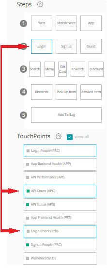

For instance, on this example, you can see that the Login Step (under the Browse Stage), is linked to 2 touchpoints:     
* API Count (APC). 
* Login Check (SYN).

And now, you will see a few more examples of the relationship of Steps to Touchpoints.

On the next example you can see the relationship of the "Login" Step, to two Touchpoints.

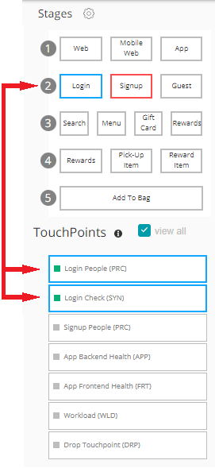

In this Example, the "Login" Step is related to two Touchpoints:
* Login People (PRC) 
* Login Check (SYN)

Return to top of [Index](#Index)

And on the next graphic you can see the relationship of a Touchpoint of the PCC type, to a particular Step, on this example; "Checkout".

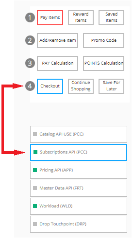

In this Example, the "Checkout" Step is related to just one Touchpoint; "Subscriptions API (PCC)".

Return to top of [Index](#Index)

And on the next graphic you can see the relationship of this Touchpoint of the APP type, to a particular Step, on this example; "Add/remove item".

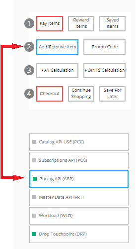

In this Example, the "Add/remove item" Step is related to one Touchpoint; "Pricing API (APP)".

Return to top of [Index](#Index)

And on the next graphic you can see the relationship of this Touchpoint of the FRT type, to a particular Step, on this example; "Pay calculation".

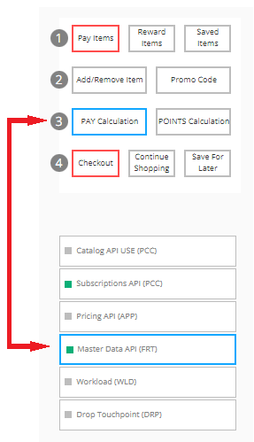

In this example, the "Pay calculation" Step is related to just one Touchpoint; Master Data API (FRT) 

Return to top of [Index](#Index)

And on the next graphic you can see the relationship of one Touchpoint of the SYN type, to a particular Step, on this example; "Order Tracking #".

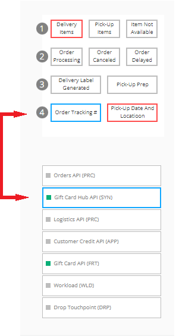

In this example, the "Order Tracking #" Step is related to just one Touchpoint; "Gift Card Hub API(SYN)". 

Return to top of [Index](#Index)

# Working with Touchpoints ###

As you read before Touchpoints are the more granular entities of the PathPoint model. TouchPoints do behave more like a specific browser application or APM (Application Monitor). And every Step of a Pathpoint is connected to one or more Touchpoints and Every Stage Status is based on the culmination of its respective Touchpoints. 

And ever since a Touchpoint is the pulse of each Pathpoint, your ability to test, tune, and work with the Touchpoint Queries are very important to getting the right data you seek.

Return to top of [Index](#Index)
## How to test a Touchpoint ###

This is a function, of a Pathpoint, that allows you to test the validity or health of a particular Touchpoint.

To begin the process of testing a Touchpoint: 1)Right click on it, and then 2)select Queries. In this example I chose the "Login People" (which is a PRC type of Touchpoint), to test this particular Touchpoint.

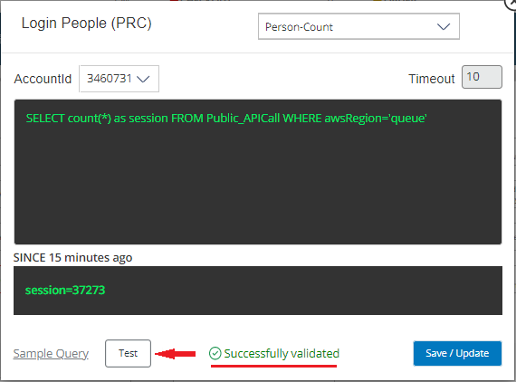

To begin testing a Touchpoint, on the Dialog box window that opens up, click on "Test", now you will see the result of the test, on this example, it says; "Successfully validated", meaning the Touchpoint is healthy.

But let's say that you change some part of the given query, for instance to test another aspect of the Touchpoint, now you must test the Touchpoint again.

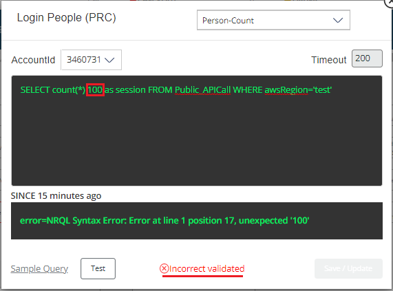

In the following example I changed the Query, in front of count(*) I added 100, and then ran the test again. Now, you can see the result; "Incorrect validation". So now the query, which was right before, is incorrect now. 

If the validation fails, find out why, and fix it, then test it again until you get the "Successfully validated" message. To save your changes click on "Save/Update". 

Please note that if you get an "Incorrect validated" error, when testing a Touchpoint, it might be something as simple as  because you are running the Query on the wrong AccountID.

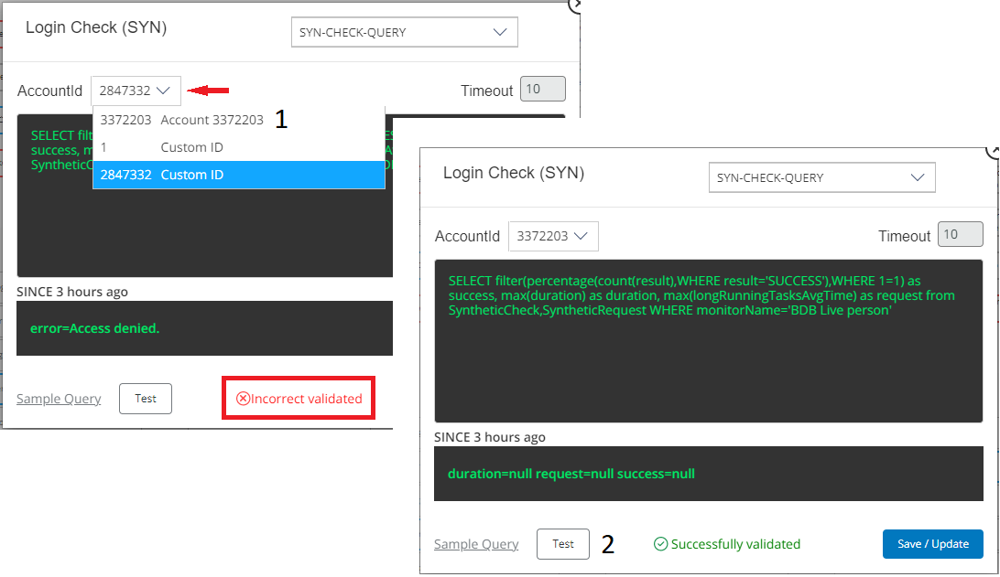

These are the steps to change it, to the right AccountID:

1 Click on the AccountID field, and then select the right AccountID.  
2 Now, test it again. If the answer is "Successfully validated", the AccountID was the issue.

Return to top of [Index](#Index)

## Setting up Touchpoints ###

This is done using the JSON configuration file, which is tailor written to the needs of your particular business.

[JSON Configuration File](#JSON_Configuration_File)

Return to top of [Index](#Index)
# Tune Touchpoint Thresholds ###

One way to get better data, from your Touchpoints, is to tweak their Tuning configuration, and keep in mind that the values you will see at the beginning of the tuning process were defined on the JSON file uploaded to your Pathpoint, and after that you can also change them, manually.

To begin this process, right click on the Touchpoint you want to Tune, and then select "Tune". If you wish to change the values of the tuning of a Touchpoint, be on the MIN part or the MAX part, click on the space, under configured and type the new value. 

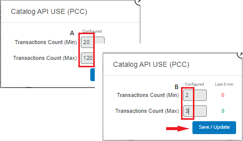

This is the way to change the value of the tuning, of a Pathpoint Touchpoint:  

A Click on the current given value, be that the Min or Max.   
B Type the new Value.

Once you change the values of the tuning, you can save them by clicking on "Save/Update".

Now, you will see some examples of the tuning of different Touchpoints.

## LOGIN PEOPLE PRC

On the next graphic you can see the tuning dialog box window of a Touchpoint of the PRC type.

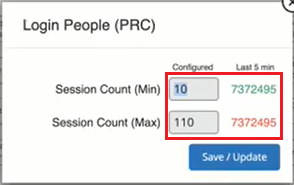

There are two important values on this Touchpoint:

* Session count (Min), if the value (under "Configured"), is  for example set at 10, and the value of sessions, within the last 5 minutes, is below this number, the status of the Touchpoint will turn red. You can change this #, for instance to 20, as your business needs require.
* Session count (Max), if the value (under "Configured"), is  for example set at 110, and the value of sessions, within the last 5 minutes, is above this number, the status of the Touchpoint will turn red. You will also see the color of the Stage label turn, from blue, to white.

## Subscriptions API (PCC)

On the next graphic you can see the tuning dialog box window of a Touchpoint of the PCC type.

There are two important values on this Touchpoint:

* Transactions count (Min), if the value (under "Configured"), is  for example set at 36, and the value of sessions, within the last 5 minutes, is below this number, the status of the Touchpoint will turn red.
* Transactions count (Max), if the value (under "Configured"), is  for example set at 136, and the value of sessions, within the last 5 minutes, is above this number, the status of the Touchpoint will turn red. You will see the color of the Stage label turn, from blue, to white.

## Login Check (SYN)

On the next graphic you can see the tuning dialog box window of a Touchpoint of the SYN type.

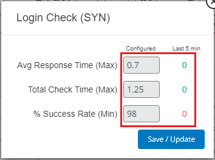

There are three important values on this Touchpoint;

* Avg response time (MAX), if the value (under "Configured"), is  for example set at .07, and the value of sessions, within  the last 5 minutes, is higher than this number, the status of the Touchpoint will turn red.
* Total Check Time (Max), if the value (under "Configured"), is  for example set at 1.25, and the value, within the last 5 minutes, is above this number, the status of the Touchpoint will turn red.  
* %Success Rate (Min), if the value (under "Configured"), is  for example set at 98, and this value, within the last 5 minutes, is below this number, the status of the Touchpoint will turn red.  

Return to top of [Index](#Index)
## How to Turn off a Touchpoint ###

You can manually work/troubleshoot a particular Touchpoint, by turning it off, and later on you can also turn it back on.

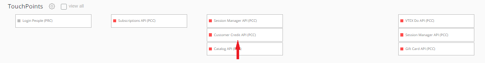

To turn off a Touchpoint, right click on it. In this example I clicked on the Customer credit API (which is a PCC type of Touchpoint).

Now, on the pop-up box window, click on the "On" symbol, to turn off the Touchpoint. Later on you can right click on the same Touchpoint, then on the "Off" symbol, to enable it again.

Return to top of [Index](#Index)  

# How to run Touchpoint Queries ###

Touchpoint queries are written in NRQL, which is New Relic's SQL-like query language. In general NRQL allows you to retrieve detailed New Relic data and get insight into your applications, hosts, and business-important activity.

Using this guide you will learn about Touchpoint Queries (programmed by the JSON file you uploaded to your Pathpoint), which you can also manually change them, as long as you don't change the main query variable that the Touchpoint is looking to get.

To begin the process of working with a Touchpoint Query: 1) Right click on the particular Touchpoint you want to work with, and then 2) select "Queries". Now, you can modify them, to get different results from the particular Touchpoint you select to work with.

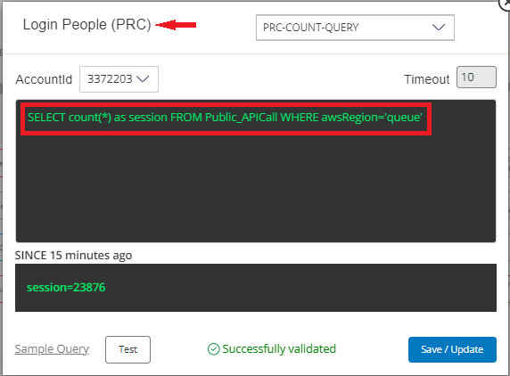

In this example graphic you can see the Query of the PRC type (used to count people) Touchpoint, in which the variable is "session".

Now, you will see some examples of Touchpoints, and their Queries purpose:

* ### SYNTHETIC CHECK (SYN)

This query purpose is to get the health status of a Synthetic monitor.

SELECT filter(percentage(count(result),WHERE result='SUCCESS'),WHERE 1=1) as success, max(duration) as duration, max(longRunningTasksAvgTime) as request from SyntheticCheck,SyntheticRequest WHERE monitorName='BDB Live person'

Has 3 variables:

      * SUCCESS, which waits for a percentage between 0 and 100
      * DURATION, duration of a process.
      * REQUEST, how long it took to respond to a request.

* ### PROCESS COUNT (PCC)
This query purpose is to count processes.

SELECT count(*) FROM Public_APICall WHERE awsRegion='us-east-1'

Waits for a value on a variable called "count"

* ### PERSON COUNT (PRC)

This query purpose is to count people.

SELECT count(*) as session FROM Public_APICall WHERE awsRegion='us-east-1'

Expects a value on a variable called "session".

FRONT END HEALTH (FRT)

This query purpose is to measure the health of the front end of your application.

SELECT filter(apdex(duration, t:1), WHERE 1=1) as apdex, filter( max(duration), WHERE 1=1) as response,filter(percentage(count(*), WHERE error is true), WHERE 1=1) as error from PageView WHERE appName='QS'

Has 3 variables:

      * APDEX, which is the result of an APDEX formula (value between 0 and 1)
      * RESPONSE, which measures the duration of a process in seconds.
      * Error, which is a percentage between 0 and 100.

* ###  INFRA WORKLOAD (WLD)

This query purpose is to get the latest workload status value.

SELECT latest(statusValue) as statusValue FROM WorkloadStatus WHERE entity.name='Demotron V2 - Acme Dev'

The only thing that can be changed on this query, is the entity name, in this example 'Demotron V2 - Acme Dev'.

* APPLICATION HEALTH (APP)

This query purpose is to measure your application backend health.

SELECT filter(apdex(duration, t:0.028), WHERE 1=1) as apdex, filter( max(duration), WHERE 1=1) as response,filter(percentage(count(*), WHERE error is true), WHERE 1=1) as error from Transaction WHERE appName='QS'

Has 3 variables:

      * APDEX, which is the result of an APDEX formula (value between 0 and 1)
      * RESPONSE, which measures the duration of a process in seconds.
      * Error, which is a percentage between 0 and 100.

Please keep in mind that once you manually change a query, that you can chose to save the changes you made, on the Touchpoint configuration.

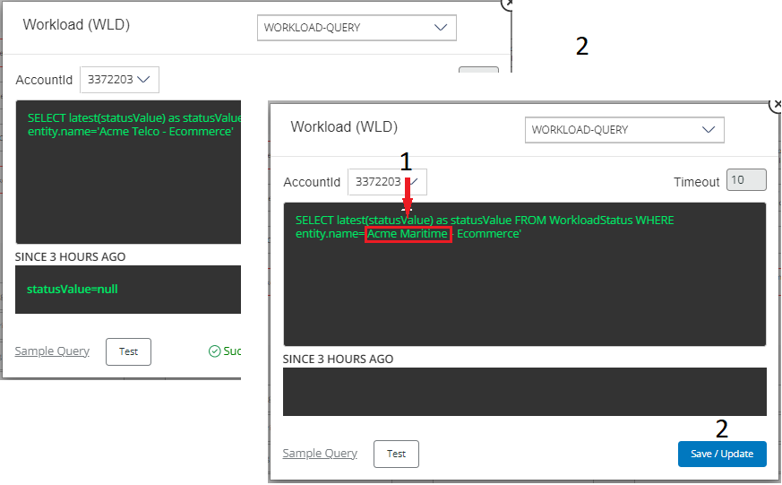

On this example, on a query on a WLD type touchpoint, I changed the entity name:

1 I began making this change, by selecting the second part of the current entity name; ".. telco", then I replaced "Telco" with "Maritime".  
2 Finally, I clicked on "Save/Update" to save this change.

The next time, after making a change and saving it, you re-open the query on a Touchpoint, the Query will be as you saved it.

Return to top of [Index](#Index)

## Configure Logging

The steps to do this are similar to the steps to configure the Flame Filter background script.

  *   [Flame Filter Background Script](#Flame_Filter)

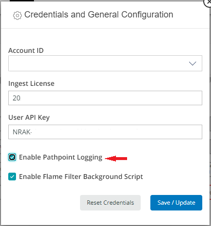

And when you apply the Ingest License, and the User API Key, select "Enable Pathpoint Logging.

Return to top of [Index](#Index)

# Using Special Filters ###

Pathpoint allows you to execute  different troubleshooting tasks using New Relic Synthetic monitors, which in turn allow you to run those tasks in the background.

## Canary Filter ###

This is an excellent way to troubleshoot your Pathpoint, because when you activate the Canary filter, Pathpoint will only begin to calculate the steps that are activated manually, which will help you illustrate the specific operation of a particular step. This is very useful when you are troubleshooting one step or in the process of a code deployment or system maintenance and want to constrain your view. 

On this Pathpoint, you can see all the different Steps that are active right now, to troubleshoot this Pathpoint, you can turn off all of these Steps, and then enable them one by one, after turning on the Canary filter.

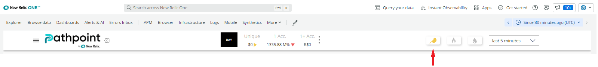

To activate it, just click on the Canary Symbol (located on the top right part of the Pathpoint window), which now changes its color to yellowish. On the Pop Up window that opens up, click on "Continue" to activate this filter.

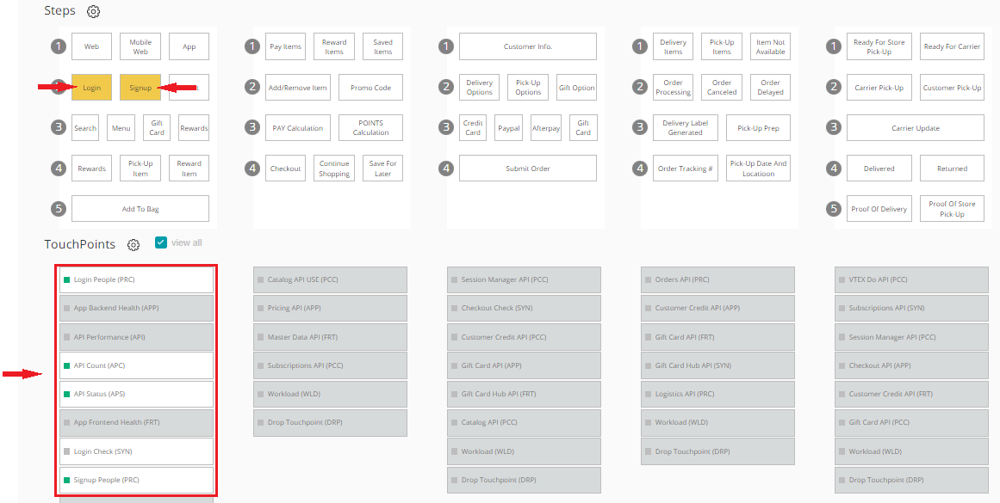

Now, you can click on any of the Steps you want to troubleshoot, to enable them, for instance "Web" and "Sigup", and also notice that this action also enables the corresponding Touchpoints, which are tied to those Steps.

Please note that when you are running the Pathpoint background job, the signals for non-visible touchpoints will still be available when you are using the Flame view.

Return to top of [Index](#Index)
## Flame Filter Background Script ###

The Flame Filter Background script will highlight the most problematic “Steps and Touchpoints” with a configurable time window and percentile threshold. When you use this filter, you will see the worst Touchpoints (the status of the Touchpoint will turn red), like for instance the ones that are not meeting the threshold as the percentage set in the tuning is concern. 

To activate it, just click on the Flame Symbol, which now changes its color, to a reddish flame. On the Pop Up window that opens up, click on "Continue" to activate this filter.

This is very useful in situations where things look okay now, but might have had a pattern of errors or latency in the recent past. To use this special Pathpoint filter you must enable it on the "Credentials and General Configuration" dialog box window.

Now, you will see the steps to enable this filter as well as the "Flame filter background script", if you haven't already enabled them.    

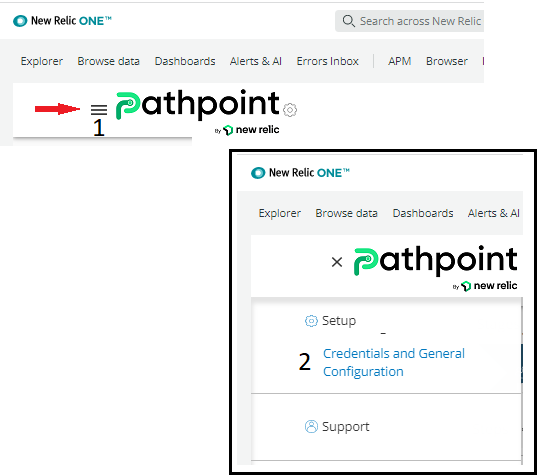

To begin this process, login to your Pathpoint, and then follow these steps to enable it:

1 Click on the three lines on the top left part of the Pathpoint window.  
2 Now, click on the option "Credentials and General Configuration".  

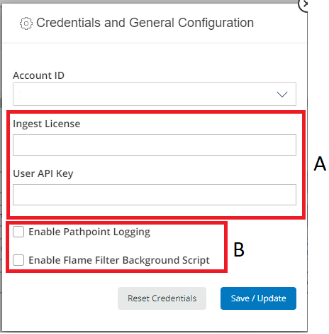

On this dialog box window you will see a few options, asking you to fill some data, and also options that you have to check:

   A To enable this filter you must first get an "Ingest License" key, as well as a "User API Key".       
   B Once you get that information, you will be able to select these two options; "Pathpoing Logging", and "Flame Filter Background Script".

 If when, you open the ""Credentials and general configuration"" dialog box window, the Ingest License key and the User API Kay and both of the options; "Enable Pathpoint Logging" and "Enable Flame Filter Background Script" are checked (meaning they were already provided), then just click on "Save/Update", or the "X" on the upper right hand of that window, to close it.

  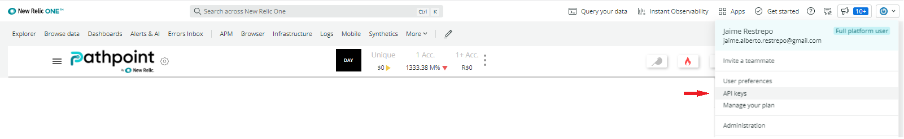

And these are the steps to get the "Ingest License" key, as well as the "User API Key":  

1 To begin, click on the Power button, on the upper right hand of the Pathpoint window.  
2 Now, click on the "API Keys" option.

  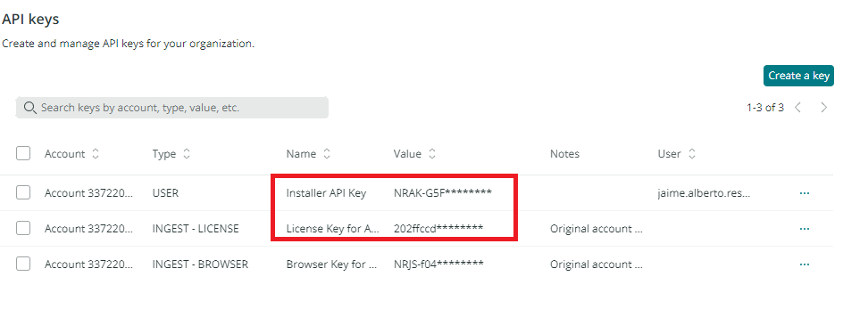

Next, you will see the Keys you need, to enable both the "Pathpoint Logging", and the "Flame Filter Background Script".

 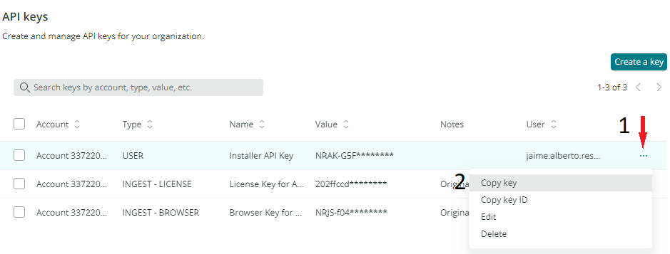

And these are the steps to copy those two API Keys, to the " Credentials and General Configuration" dialog box window:  

1 Click on the 3 dots, on the right of the user name, first for the "Installer API Key".  
2 Now, click on "Copy key".

Now, return to the main Pathpoint One window, which can be easily achieved by clicking on the URL Address bar, typing "one.newrelic.com", and then pressing on the "Enter" key, to load the main Pathpoint page.You will need to, if you haven't done so, supply your credentials (user name and PW) and then finding and launching the Pathpoint App.

Finally, to install these Keys, return to the "Credentials and general configuration" window:  

1 Again, click on the three lines on the top left part of the Pathpoint window.  
2 Now, click on the option "Credentials and general configuration" window.  

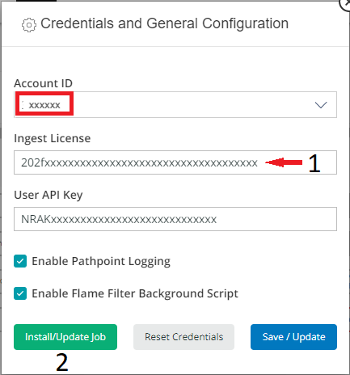

These are the steps, once you check that the Account ID is the right one (if not change it to the right one), to apply both of these Keys:  

1 Right click on the white space of the corresponding Key you got, if for instance you copied the "Ingest License" Key, right click on the empty cell under its name, and then select Paste to copy the key there. CTRL + V also works. Repeat the previous steps to get the other key you need, for instance the "User API Key", and then right click on the white space under the "User API Key", and then select Paste, to copy it there.  
2 Finally, click on "Install/Update Job", then on "Save/Update".

Now, both Pathpoint Logging, and Flame Filter Background Script will be enabled.

Return to top of [Index](#Index)

## Drop Filter ###

The Drop filter calculates the order or transaction loss by stage with their monetary equivalents according to the values set in the tunning. It also shows the steps that are causing drops.

 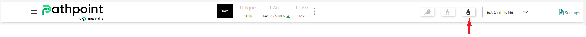

 To activate it, just click on the tear-drop Symbol, which now changes its color to black. Now, if at least one of your Steps has a Touchpoint of the Drop(DRP) kind, you will see a dollar amount, on top of the corresponding Step.

 

 On the example figure above, you can see that all the five Steps of this Pathpoint have Touchpoints of the Drop(DRP) kind. You can clearly see the dollar amount of the order or transaction loss by Step, and that each one of the related Steps are in black.

To tune this filter, so that the information it presents to you is more meaningful, click on the drop symbol, for the "Drop filter", with the right mouse button.

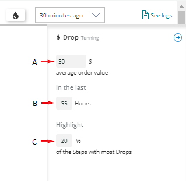

These are the steps to tune the Drop filter, of a Pathpoint, to taylor the data you see on the Steps with touchpoints of the Drop(DRP) kind: 

A To change the "Average order value", click on the number you see here, and type a new one.  
B To change the time period of the sampled data, type it here, for instance 45, instead of 55.  
C To reduce, or increase the percentage of Steps you will see with the most drops, type a new number here. 

You don't need to press Enter, after each change, and the changes you make will stay saved, until you change them again.

Return to top of [Index](#Index)

