## Pathpoint Configuration File
  

The configuration of pathpoint is managed by a powerful JSON configuration file that let's us add and configure stages, steps, and touchpoints. The file can be uploaded and downloaded directly from the Pathpoint UI.


### Uploading a New Config File

Pathpoint offers the possibility to load the configuration file through the following option.

1. Go to the menu at the top left <br>
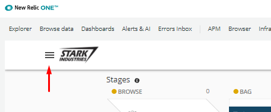 <br>
2. Enter the option "JSON Configuration" <br>
 <br>
3. Then select "Update" <br>
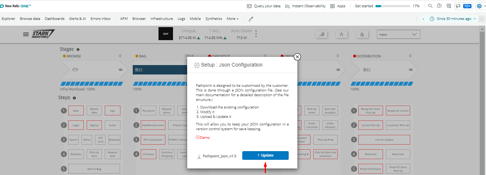 <br>
4. Locate the file you want to update and click on "open" <br>
 <br>
5. Finally the pathopint is displayed with the latest update loaded. <br>
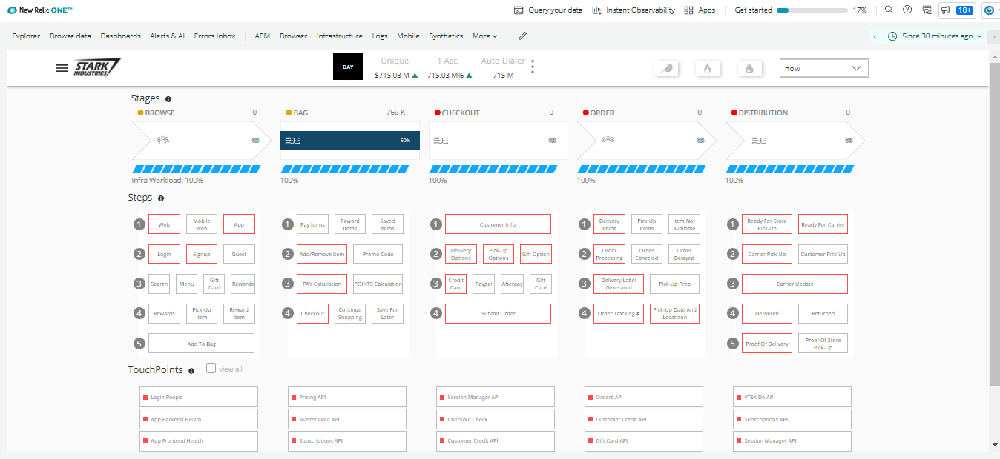
<br>  

### Downloading the Currently Active Config File

Similarly, Pathpoint offers the possibility of downloading the configuration file through the following option.

1. Go to the menu at the top left <br>
 <br>
2. Enter the option "JSON Configuration" <br>
 <br>
3. Then select the option available to download "Pathpoint_json_vX" <br>
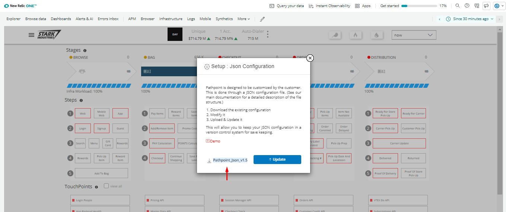 <br>
4. Host the file in the location you want <br>
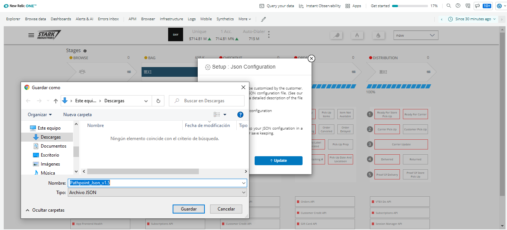 <br>
5. Finally the file is downloaded for your consultation <br>
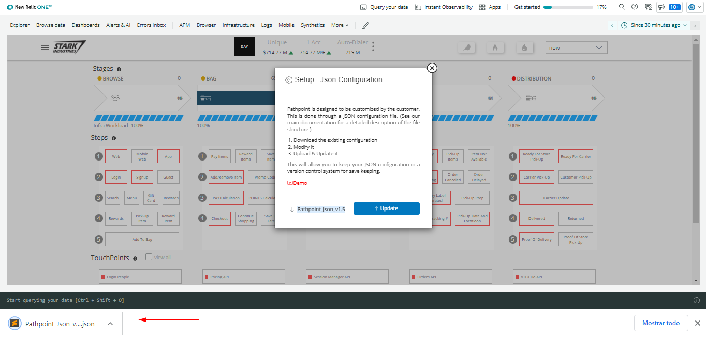 <br>

### JSON Format Explained
JSON for its acronym (JavaScript Object Notation) is a data structure, whose basic function is to allow the exchange of information. Through this structure it will be possible to identify each of the elements and components that will facilitate the implementation of Pathpoint, knowing the function of its attributes, queries and data output.

#### 1. KPI
KPI by its acronym (Key Performance Indicator), are normally known as key indicators, which allow knowing the performance of a process. In the case of Pathpoint, KPIs fulfill a fundamental function, which is the measurement of specific indicators within a particular process.  Pathpoint allows for the configuration of several `ad hoc` KPIs to be shown in the top banner.  These are option.  To omit them just configure your kpis section to an empty list like so

```
"kpis": [],
```

#### - Structure KPI

   
     "kpis": [
        	{
             	    "type": 101,
            	    "name": "Total Purchases",
            	    "shortName": "PURCH",
            	    "measure": 
		      [
                	{
                    	"accountID": 1606862,
                    	"query": "SELECT count(*) as value FROM Transaction where appName = 'Order-Processing' where name = 'Controller/Sinatra//purchase' and http.statusCode = 200 COMPARE WITH 1 week ago",
                    "link": "https://onenr.io/08dQePr1dje"
                	}
            	      ],
            "value_type": "FLOAT",
            "prefix": "",
            "suffix": ""
        	}
	    ]

Where:

 - ***Type***: *Defines the type of measurement to be performed, which can be: <br>
 -- "100" returns the current measurement value.  
 -- "101" returns the current value and compares it with the value of "X" previous days*
 - ***Name***: *Corresponds to the long name of the KPI.*
 - ***ShortName***: *Corresponds to the short name of the KPI.*<br><br>
 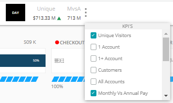 <br><br>
 - ***Measure***: *The data that allow the measurement to be made is displayed*.
 - ***accountID***: *Corresponds to the number that identifies the measurement performed*. 
 - ***Query***: *Corresponds to the query that is used to perform the measurement*. 
 - ***Link***: *Corresponds to the link that directs to the KPI dashboard.*<br><br>
  <br><br>
 
 - ***Value_type***: *It can be an integer value "INT" (example: 100) or a decimal value "FLOAT" (example: 100,2)*.<br><br>
 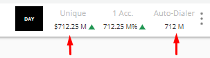 <br><br>
 - ***Prefix***: *It is used in the case in which you want to Identify the KPI by placing a symbol or letter at the beginning of the name. Example: USD 12000*
 - ***Suffix***: *It is used in the case where you want to Identify the KPI by adding a symbol or letter at the end of the name. Example: 5%*.
 <br><br>
  <br><br>

#### - Example KPI<br>
<br><br>

#### - KPI Pathpoint Image

<br>

<br>


#### 2. Stages  
Here you can see the business stages at a high level. For each commercial stage, different services and methods are presented at the system level. Based on business information, PathPoint previews latency indicators.
All the information related to the stage, including the errors for each one of them, allows to detail certain aspects at a high level. In a stage we can see first-hand if any of its associated touchpoints is critical, and if this happens, then the stage will turn yellow. If it stays green, it means that everything is working normally. And if the stage turns red, it means that all its touchpoints have anomalies.

#### - Structure Stage

	"stages": 
	[
           {
            "title": "BROWSE",
            "active_dotted": "none",
            "arrowMode": "FLOW",
            "percentage_above_avg": 20,
	    	"steps": 
		 [
		  "Code steps..."
		 ]
		    "touchpoints": 
			[
			   "Code touchpoints..."
			]
	   }
	 ]
	  
	  
Where:
 - ***Title ***: *Corresponds to the name that identifies the stage* <br>
 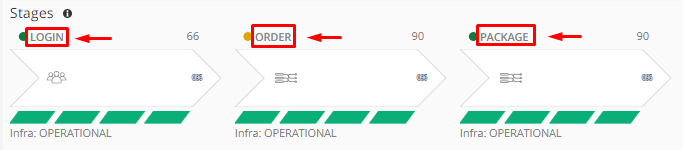<br> 
 - ***Active_dotted***: *Defines the display of the start or end of a flow. It only handles three values: "none", "dotted" or "dashed". By default it takes the value "none". When the value is changed to "dotted", it adds some dotted lines to the left of the stage where it is defined. When the value is changed to "dashed", it adds some dashed lines to the left of the stage where it is defined.* <br>
 Here is an example when activating "dotted" <br>
 <br>
 - ***ArrowMode***: *Defines the shape of the arrow on the header of the Stages. It only handles two values: "FLOW" and "STATIC". By default it is "FLOW"* <br>
 Example with "FLOW"<br>
 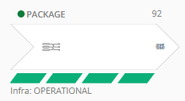<br>
 Example with "static" <br>
 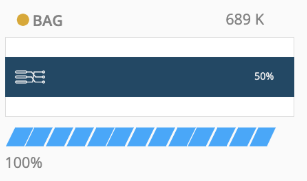<br>
 - ***Percentage_above_avg***: *Indicates the percentage that is above the mean* <br>
 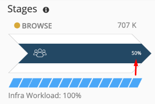<br>

#### - Examples stage <br>
Example 1<br>
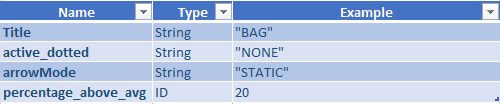
<br><br>
Example 2<br>
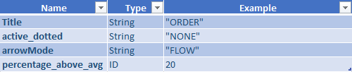<br><br>


#### 3. Steps
These are "sub-stages" of a main stage and represent a certain degree of granularity in your services. 

#### - Structure Steps

	"steps": [
                  {
                    "line": 1,
                    "values": 
		     [
                        {
                            "title": "Web",
                            "id": "ST1-LINE1-SS1"
                        },
                        {
                            "title": "Mobile Web",
                            "id": "ST1-LINE1-SS2"
                        },
                        {
                            "title": "App",
                            "id": "ST1-LINE1-SS3"
                        }
		     ]
		   }
                 ]

Where:
- ***Line***: *Positions the row in which the task is located within the stage.* <br>
 <br>
- ***Values***: *Indicate the parameters for each step. Currently the parameters "title" and "ID" are considered*
- ***Title***: *Corresponds to the name with which the step is identified.* <br>
 <br>
- ***ID***: *Corresponds to the code that identifies the step in its order within the row that is located. For the example, in line 1 the "Web" step is assigned the order # 1, the "Mobile Web" step has the order # 2 assigned and the "App" step is assigned the order # 3 in its configuration.* <br>
 <br>

#### - Examples Steps <br>
Example 1<br>

<br><br>
Example 2<br>
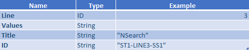<br><br>

#### - Steps Images
When you click on any of the steps, even more detailed services and functions will be displayed in the list of associated TouchPoints. When a stage has a red border, it means that there is an error type anomaly for that stage. <br>

A step contains one or more contact points. Each step allows business stakeholders to understand the performance of the system in some way without going into all the implementation details. <br> 

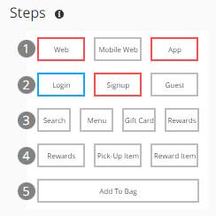

#### 4. Touchpoints
These detail the more granular entities of the PathPoint model. TouchPoints behave like a specific browser application or APM (Application Monitor). The health status of a TouchPoint will be linked to the error rate and latency. <br>

#### - Structure Touchpoint

	"touchpoints": 
	[
                {
                    "title": "Login People",
                    "status_on_off": true,
                    "dashboard_url": 
		    [
                        "https://onenr.io/01qwL8KPxw5"
                    ],
                    "related_steps": "ST1-LINE2-SS1",
                    "queries": 
		    [
                        {
                            "type": "PRC-COUNT-QUERY",
                            "accountID": 1606862,
                            "query": "SELECT count(*) as session FROM Transaction WHERE appName='WebPortal'",
			    "query_timeout": 10,
                            "min_count": 100,
			    "measure_time": "5 MINUTES AGO"
                        }
                    ]
                }
          ]

Where:
- ***Title***: *Corresponds to the name that identifies the touchpoint.* <br>
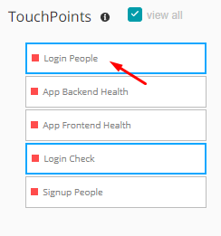 <br>
- ***Status_on_off***: *This option allows you to enable or disable a touchpoint for display mode. To access this view, you just have to right click on the touchpoint and select the option "on/off"* <br>
 <br>
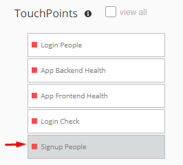 <br>
- ***Dashboard_url***: *Corresponds to the link that directs to the tochpoint dashboard.* <br>
- ***Related_steps***: *Indicates the step to which it is associated. For the example, the "Login People" touchpoint is linked to the "Login" step.* <br>
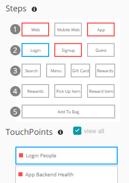 <br>
- ***Queries***: *Here you can determine all the query parameters that alert the touchpoint. To access this view, you just have to right click on the touchpoint and select the option "queries"* <br>
- ***Type***: *Identify the type of query. For the example, it is a session count, hence the abbreviation PRC-People Count (Vew section "Different Touchpoint Types Explained")* <br>
- ***AccountID***: *Determines the code with which the query is identified.* <br>
- ***Query***: *Displays the query that actually determines the tocuhpoint.* <br>
- ***Query_timeout***: *Determines the maximum time of activity in which the query will be executing.* <br>
- ***Min_count***: *The query will present a minimum of 100 records.* <br>
- ***Measure_time***: *Determines from when I want the query to collect information to perform the measurement. Example, 5 minutes ago* <br>
 <br>
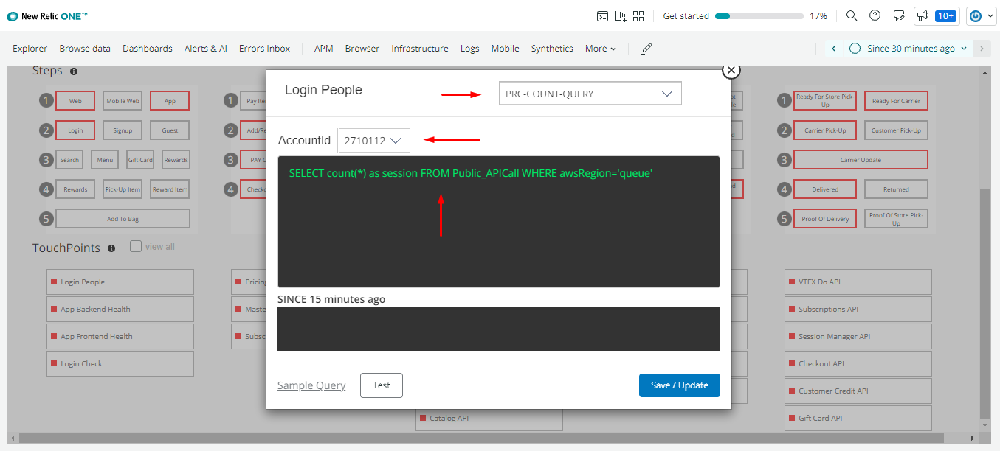 <br><br>

#### - Examples Touchpoint <br>
Example 1<br>
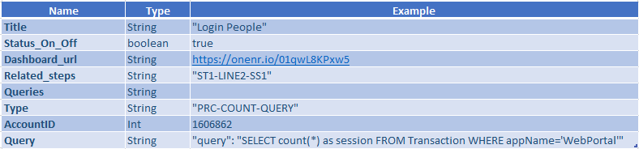
<br><br>
Example 2<br>
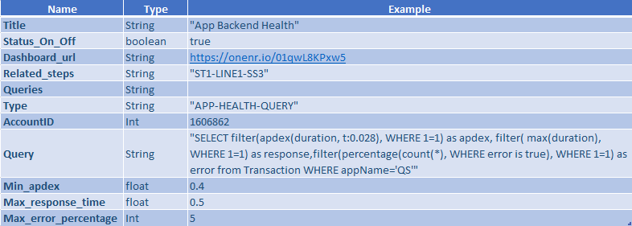<br><br>

#### - Touchpoint Images
In this section you can view all the configured touchpoints, or if you wish you can see only the ones that present problems (to do this, just deactivate the "view all" box). <br><br>
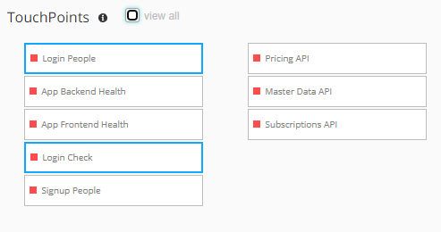<br>
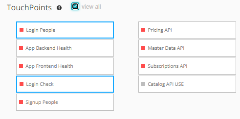<br><br>
When you select a step, Pathpoint will highlight the touchpoints related to that step. If the touchpoints are healthy, the step will be outlined in blue. If any of the touchpoints show anomalies, the step will be marked in red outline. <br><br>
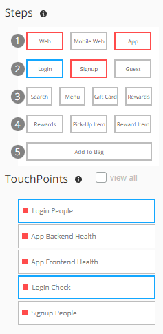 <br>


### Different Touchpoint Types Explained
Pathpoint offers different types of touchpoints, which are adapted according to the needs of the business. Below is the description and a brief example for each case:

#### PRC (Person Count) 
●	Data: <br>
○	User Sessions  

●	Tunning: <br>
○	Session Count (Min)

●	Link: PRC Touchpoint Flashboards <br>
○	Current Sessions <br>
○	Past Sessions <br>
○	Previous Week Comparison <br>

 <br><br>
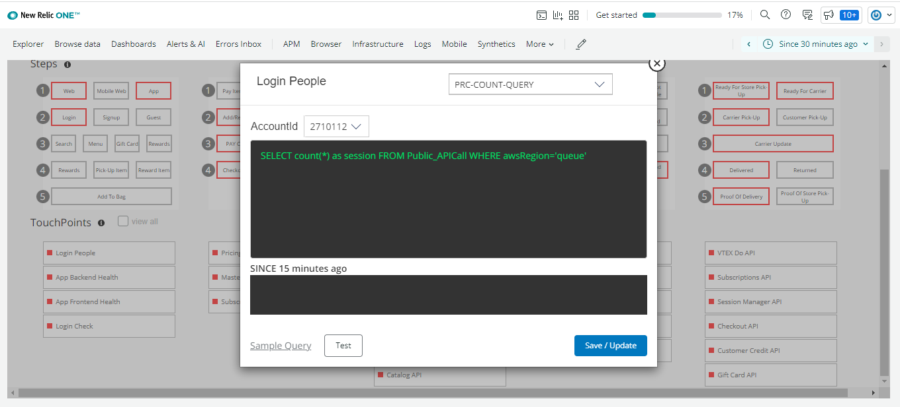 <br>
#### PCC (Process Count) 
●	Data: <br>
○	Transactions  

●	Tunning: <br>
○	Transactions Count (Min)

●	Link: PCC Touchpoint Flashboard  <br>
○	Current Transactions <br>
○	Past Transactions <br>
○	Previous Week Comparison<br>

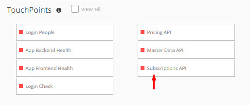 <br><br>
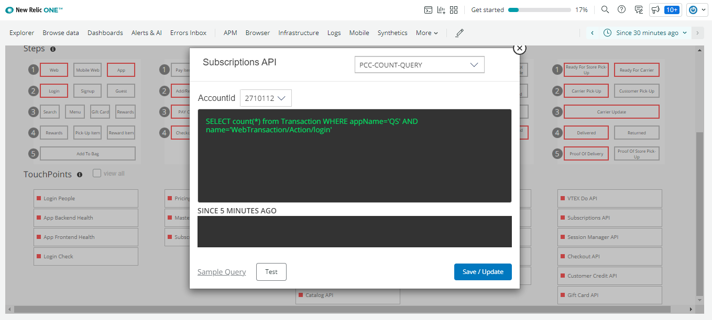 <br>
#### APP (Application Health) 
●	Data:  <br>
○	Transactions

●	Tunning: <br>
○	APDEX Response (Min) <br>
○	% Error (Max) <br>
○	Response Time (Max) <br>

●	Link: APM Transaction Dashboard <br>
○	APDEX <br>
○	Throughput <br>
○	Breakdown <br>
○	Traces<br> <br>

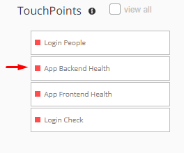 <br><br>
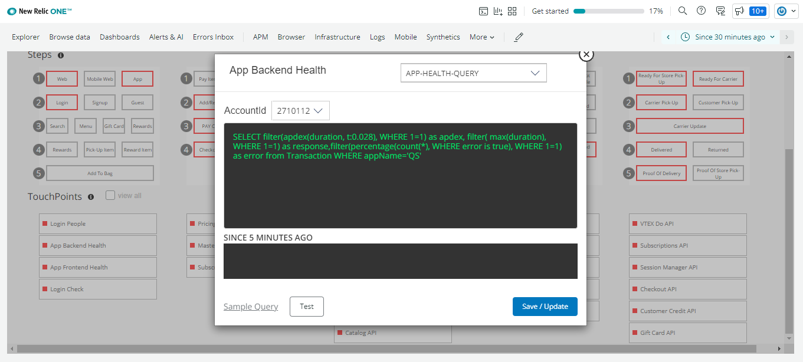 <br>
#### FRT (Front End Health) 
●	Data:  <br>
○	Transactions

●	Tunning: <br>
○	APDEX Response (Min) <br>
○	% Error (Max) <br>
○	Response Time (Max)

●	Link: Page View Transaction Dashboard <br>
○	APDEX <br>
○	Throughput <br> 
○	Breakdown <br>
○	Traces <br>

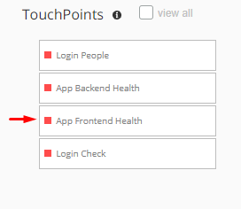 <br><br>
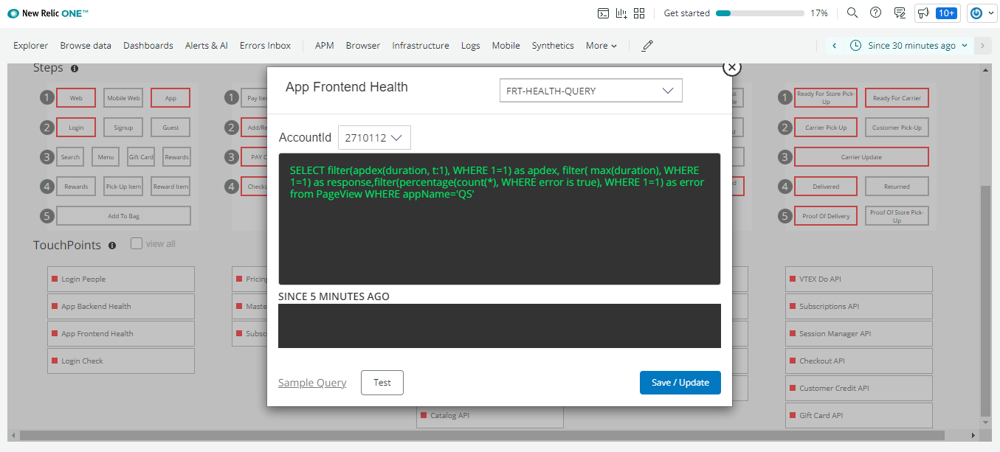 <br>
#### SYN (Synthetic Check)  
●	Data: <br>
○	Synthetic Monitor Data

●	Tunning: <br>
○	Avg Request Time (Max) <br>
○	Total Check Time (Max) <br>
○	% Success Rate (Min) 

●	Link: Synthetic Monitor Results Dashboard <br>
○	Long Running Tasks <br>
○	Bytes Transferred <br>
○	Requests <br>
○	Total Time <br>
○	Requests Waterfall <br>

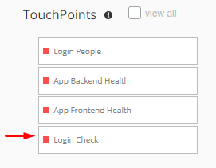 <br><br>
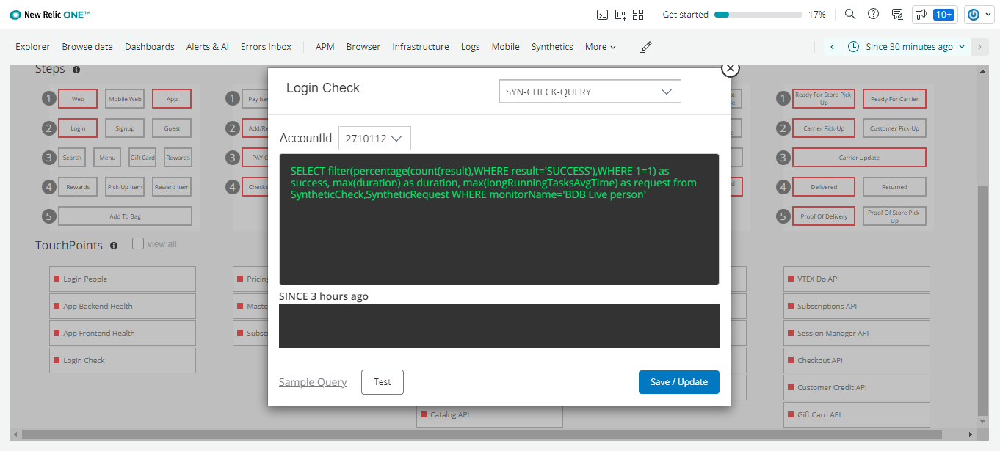 <br>
  

### Example JSON Files for Different Business Sectors
- Basic E-Commerce
[TBD]
- Streaming Media
[TBD]
- Shipping & Logistics
[TBD]
- OTHER (check with Federico)
[TBD]
