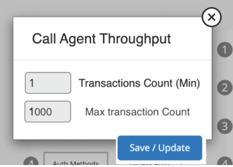
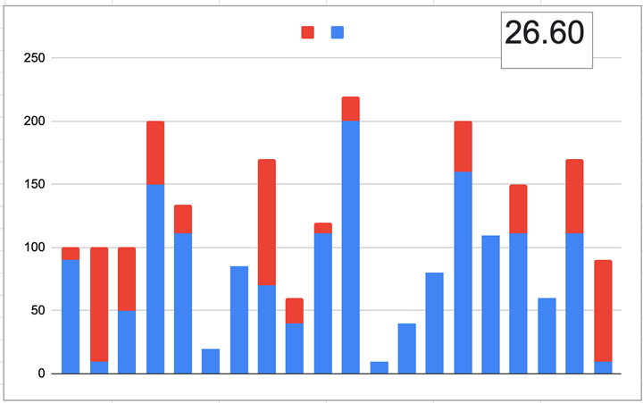
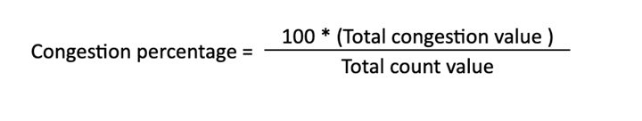

## New Congestion algorithm (1.5.4)

A new way to calculate congestion is implemented, based on the formule developed. 
- ***It uses the Count touchpoints, PCC and PRC*** 
- ***It adds a new property to the tuning, defining the max acceptable value.***  
## "Max transaction Count” in the figure  
  
- ***It is required at least 2 count touchpoints in a stage for the formule to work.***  
It is defined that a touchpoint is congested when its value is over the max defined in the tuning, the more it is over that value, the more congested the touchpoint is.  
***Example:***  
In the graphic it is shown in red all the values generating congestion 
  
***Formula*** 
What is causing Congestion: Values over Max value set in tuning  
- ***Total Congestion Value:	 Sum of all values that are above max set value***  
- ***Total Count Value: Sum of all touchpoints values***  
- ***Congestion Percentage = Hundred multiplied by the total congestion Value divided by the total count value***  
  
